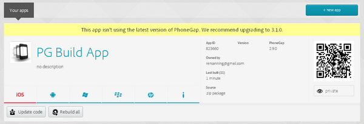
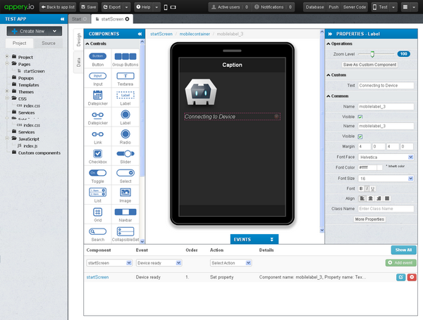

# Cordova 3.x 基础（15） -- 云端 Cordova 
通过 Web 界面上传 HTML/CSS/Javascript 源代码后，在云环境（ICE）中把这些代码转换成不同平台的 app。以下简单试用了一下 PhoneGap Build、AppBuilder、Appery.io、Monaca、SAE 云窗调试器等5个服务。 

- 编译出来的 APK 文件除过 Monaca 获取的权限太多无法安装、SAE 云窗调试器只是调试工具，基本都能够很好的实现自动化编译。
- Appery.io 编译出来的 APK 文件最大2.3 M、PhoneGap Build 编译出来的最小210 K。
- PhoneGap Build 只是打包所以操作最简单。
- AppBuilder（Icenium）在各个方面都表现良好。

**（1）PhoneGap Build [https://build.phonegap.com/](https://build.phonegap.com/)** 

①可以通过 Git 地址或者 zip 文件上传代码 

②上传代码 

③点击“Ready to Build” 

④左下角各个平台开始编译 

⑤红色代表有错误，蓝色代表编译成功，点击成功的图标即可下载 app 

⑥点击项目名“PG Build App”进入应用详细 

同时 Phonegap Build 被集成到了 Adobe 的其他产品中，比如 Dreamweaver CC、Edge Code CC 中。相关的 Key 需要提前设置，比如：在 Apple 的开发中心创建认证文件，Cert File->p12 File->App ID->Device ID->Provisioning profile。然后在 Phonegap 的 Account 中，在 Signing Keys 中“add a key”选择 p12和 mobileprovision 文件。具体参考：[http://docs.build.phonegap.com/en_US/signing_signing-ios.md.html](http://docs.build.phonegap.com/en_US/signing_signing-ios.md.html) 

**（2）AppBuilder（Icenium）  http://www.telerik.com/appbuilder** 

①创建项目 

②IDE 主界面 

③选择菜单 Add > Add from Archive 

④确认上传文件的位置及内容 

⑤选择菜单 Run > build 

⑥build 成功后即可下载 app 

**（3）Appery.io（Tiggzi）  [http://appery.io/](http://appery.io/)** 

①Dashboard 主界面

②创建项目 

③IDE 主界面 

④App 设置中可以看到使用的 PhoneGap3.3.0 

⑤不能上传文件，所以可以通过"Create New"来新建页面

⑥从菜单“Export”导出 app 

⑦导出中 

⑧导出完成后即可下载 app 

**（4）Monaca [http://monaca.mobi/](http://monaca.mobi/)** 

①Dashboard 主界面 

②创建项目（有很多模板可以选择）

③选择一个模板后输入项目名称 

④项目创建完成 

⑤点击“Launch IDE”进入 IDE 主界面

⑥选择 Build  

⑦Build 中

⑧Build 完成后可下载 app 

**（5）SAE 云窗调试器 [http://sae.sina.com.cn/?m=mobile](http://sae.sina.com.cn/?m=mobile)** 

①需要在 SAE 应用管理中心新建一个移动应用的托管后编辑代码 

②修改完代码后可以在 移动应用 > 应用打包 处 build 

③Build 成功后可下载 app 

④安装的云窗户调试器 

[Popular ICEs for mobile hybrid app development](http://www.developereconomics.com/popular-ices-mobile-hybrid-app-development/) 

