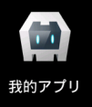

# Cordova 3.x 基础（5） -- 配置文件 config.xml

首先要注意的是：**从3.3版本以后已经把 www/config.xml 移动到了根目录下**。 

在 config.xml 中定义的东西应该适应所有平台。在  build 工程的是时候，会看到“Generating config.xml from defaults for platform "android"”这样的字样，他会生成各个平台的 config.xml。 

生成的文件： 

- Android：MyProject/platforms/android/res/xml/config.xml.
- iOS：MyProject/platforms/ios/MyProject/config.xml.

生成的 config.xml 当然会根据平台不同加入不同的内容。   
比如 Android 下就就在 config.xml 添加了以下内容： 

Xml **代码**

```
<preference name="loglevel" value="DEBUG" />
<feature name="App">
	<param name="android-package" value="org.apache.cordova.App" />
</feature>
```


config.xml 文件的 Scheme 基于 [W3C 的 Widgets](http://www.w3.org/TR/widgets/) 定义。 

**基本构造**： 

Xml **代码**

```
<widget>
  <name></name>
  <preference />
  <feature>
    <param />
  </feature>
  <access />
  <content />
</widget>
```

**preference**： 

选项设置。应用运行时的一些参数，根据平台设置的内容不同。   
Android 设置：[http://cordova.apache.org/docs/en/3.4.0/guide_platforms_android_config.md.html](http://cordova.apache.org/docs/en/3.4.0/guide_platforms_android_config.md.html)   
iOS 设置：[http://cordova.apache.org/docs/en/3.4.0/guide_platforms_ios_config.md.html](http://cordova.apache.org/docs/en/3.4.0/guide_platforms_ios_config.md.html) 

**access**： 

域限制设置。应用中如果读取其他域中的HTML文件，而该文件中如果使用了 cordova.js，那么他就能访问手机的本地功能。遵守 [W3C Widget Access](http://www.w3.org/TR/widgets-access/) 规范。   
可以设置多个：   
<access origin="http://example.com" />   
<access origin="http://foobar.example.com" />   
也可以使用通配符：   
<access origin="http://*.example.com" />   
默认可以访问任何域。   
<access origin="*" /> 

**feature**： 

应用中使用了哪些 Native 功能，Cordova 在运行时会扫描 feature 属性就知道哪些 Plugin 是有效的。在执行 cordova plugin add 的时候会自动添加 feature。 
比如：   

**引用**

```
cordova plugin add org.apache.cordova.camera 
cordova build
```

platforms/android/res/xml/config.xml 中就会多了以下内容： 

Xml **代码**

```
<feature name="Camera">
	<param name="android-package" value="org.apache.cordova.camera.CameraLauncher" />
</feature>
```

**content**： 

应用的入口文件。默认是 index.html。 

**其他**： 

widget 的 id 属性，Android 的话就是应用的 package 名，iOS 是 AppID。   
widget 的 version 属性就是应用的版本号（android:versionName）(3.5版本中可以 android-versionCode="10")。   
name 标签就是应用的名字（把文件保存为 UTF-8支持中文）。



***在"cordova create"的时候，App 名不能全部是分英文字母，比如，"我的应用"。必须包含英文字母，因为 CordovaCLI 要用来生成 MainActivity 的 Class 名． 

***这个问题最新版已经 Fixed。[CB-6511](https://issues.apache.org/jira/browse/CB-6511) Fixes build for Android when app name contains unicode characters. 

**设置版本** 

iOS   
Version (CFBundleShortVersionString)   
Build (CFBundleVersion)   
Android   
android:versionName   
android:versionCode   

**应用名的国际化 **

iOS   
CFBundleDisplayName = "Sample App Name";   
Android   
strings.xml app_name = "Sample App Name";  