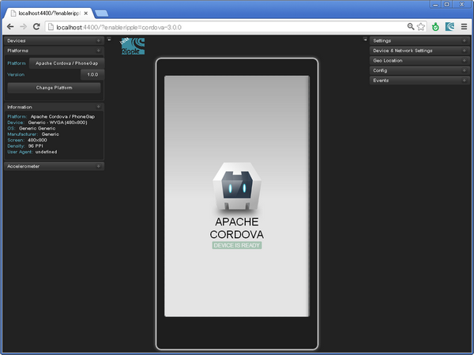
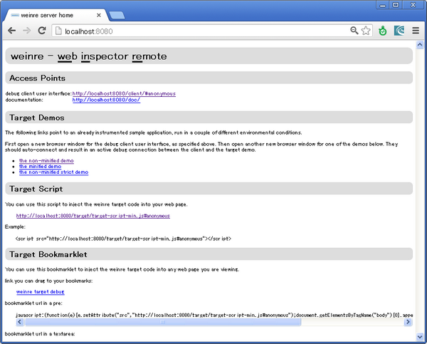
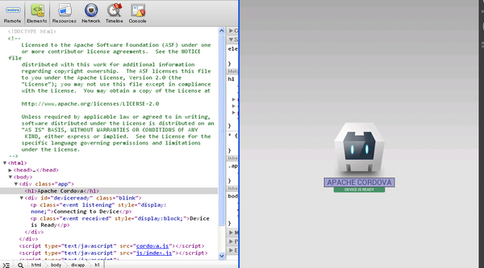
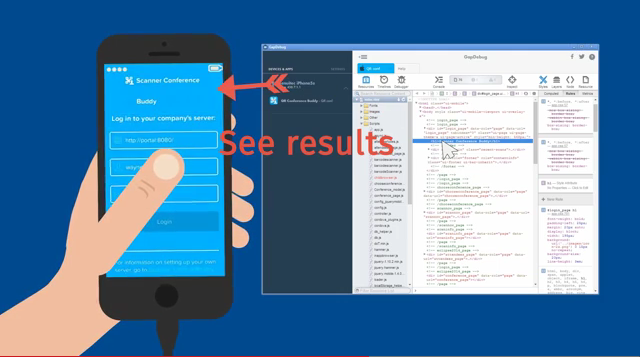
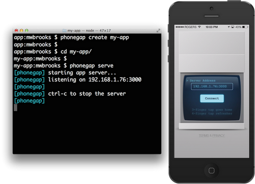
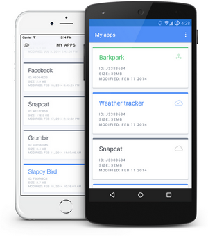

# Cordova 3.x 基础（3） -- 调试工具 Debug

## （1）Ripple Emulator 

是基于 Google Chrome 的移动应用模拟器，已经捐赠给了 ASF。Apache Ripple：[http://ripple.incubator.apache.org/](http://ripple.incubator.apache.org/) 

Chrome Webstore 安装地址： 
[https://chrome.google.com/webstore/detail/geelfhphabnejjhdalkjhgipohgpdnoc](https://chrome.google.com/webstore/detail/geelfhphabnejjhdalkjhgipohgpdnoc) 

安装 Ripple Emulator 

**引用**

```
npm install -g ripple-emulator
```

创建 Android 测试工程 app1 

**引用**

```
cordova create app1 
cd app1 
cordova platform add android
```

启动 Ripple 

**引用**

```
ripple emulate
```

启动 Chrome 浏览器   
http://localhost:4400/?enableripple=cordova-3.0.0 



iOS 工程也一样，但是默认 Ripple 进入 Android 模拟器，所以会报错，在左侧的 Devices 那里选择 iPhone5 或者 iPad 切换设备即可。 

[http://www.raymondcamden.com/index.cfm/2013/2/6/Using-Ripple-for-PhoneGap-Development](http://www.raymondcamden.com/index.cfm/2013/2/6/Using-Ripple-for-PhoneGap-Development)   
[http://www.raymondcamden.com/index.cfm/2014/1/17/Installing-and-Using-Ripple-for-Cordova-Development-A-Video](http://www.raymondcamden.com/index.cfm/2014/1/17/Installing-and-Using-Ripple-for-Cordova-Development-A-Video) 


## （2）weinre 

Web Inspector Remote、是基于 WebKit（比如 Chrome、Safari）的调试工具。 

安装 

**引用**

```
npm install weinre
```

启动 

**引用**
```
node node_modules\weinre\weinre
```

访问    
http://localhost:8080 



**Windows 下的安装路径在：    
C:\Documents and Settings\RenSanNing\node_modules\weinre 

修改 www/index.html，添加以下代码： 

Html **代码**  

```
<script src="http://localhost:8080/target/target-script-min.js#HelloCordova"></script>
```

访问以下 URL 后，Targets 有了文件连接后，切换到 Elements 后就能调试页面了。   
http://localhost:8080/client/#HelloCordova 



要是 Targets 为 none 的话，换个 IP 和端口： 

**引用**

```
node node_modules\weinre\weinre --boundHost 192.168.21.198 --httpPort 9090
```


## （3）GapDebug 

Genuitec 开发的本地调试 Cordova 应用（iOS&Android）的工具，免费。Genuitec 可能没几个人知道，不过他们开发的 MyEclipse 没人不知道吧。   
https://www.genuitec.com/products/gapdebug/ 




详细可以参考[这篇文章](http://www.raymondcamden.com/2014/7/2/GapDebug-a-new-mobile-debugging-tool)。 

## （4）PhoneGap Developer App 

不需要编译就能在真机上测试应用，GapReload 和 LiveReload 一起使用也可以做到相同的事。通过 phonegap serve 指令起一个服务器，通过 WiFi 与一台移动设备上的 PhoneGap 配对。这台服务器监控代码的变动，并把它们自动地发送到那台设备上，而不用执行本地编译。   
[http://app.phonegap.com](http://app.phonegap.com/) 



## （5）Ionic View 

[http://view.ionic.io/](http://view.ionic.io/) 



