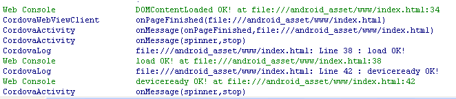
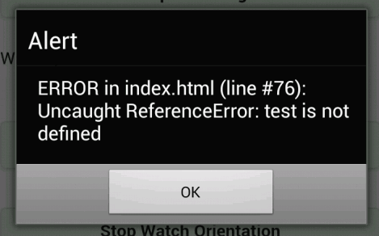

# Cordova 3.x 基础（4） -- deviceready 事件

Cordova 框架中第一个应该掌握的就是这个 deviceready 事件。采用 Cordova 开发的应用在运行的时候，Cordova 提供的通过 HTML5调用 Native 功能并不是立即就能使用的，Cordova 框架在读入 HTML5代码之后，要进行 HTML5和 Native 建立桥接，在未能完成这个桥接的初始的情况下，是不能调用 Native 功能的。在 Cordova 框架中，当这个桥接的初始化完成后，会调用他自身特有的事件，即 deviceready 事件。 

所以首先应该在 HTML 中注册 deviceready 的事件监听，在它的 CallBack 函数中再去使用 Cordova 的功能。   

Js **代码**

```
document.addEventListener('deviceready', function () {
  console.log('Device is Ready!');
  // ....your code
}, false);
```

需要注意的是，deviceready 事件是在每回读入 HTML 的时候都会被调用，而不只是应用启动时调用。 

除了 deviceready 事件以外，Cordova 应用在内部读取 HTML 代码的时候还会调用一些其他的事件。但这些并不是 Cordova 框架提供的事件，而是嵌入的 Webview 的浏览器 Render 引擎提供的。 

**DOMContentLoaded 事件** 

页面的 DOM 内容加载完成后即触发,而无需等待其他资源（CSS、JS）的加载。 

**load 事件** 

在 DOMContentLoaded 事件之后，其他资源加载完成后触发。 

所以，其实调用的顺序是：DOMContentLoaded -> load -> deviceready 
deviceready 事件一定是在 load 事件之后，所以 load 事件的执行速度会影响到 deviceready 事件的调用。把一些不必要的资源可以在 deviceready 事件之后调用从而提高执行速度。 

Js **代码**

```
document.addEventListener('DOMContentLoaded', function () {
  console.log('DOMContentLoaded OK!');
}, false);

window.addEventListener('load', function () {
  console.log('load OK!');
}, false);

document.addEventListener('deviceready', function () {
  console.log('deviceready OK!');
}, false);
```



需要注意的是，在 Cordova 的 app 中如果 js 执行失败，前台不会有任何提示（后台会出 log），所以很多时候点击都没有任何反应，那说明 JS 执行出错了，把以下代码加到 index.html 中，当应用发生 JS 错误的时候，会调用 window 的 onerror 方法从而显示错误信息，从而捕获 JavaScript 的 Error 提示用户。 

Js **代码** 

```
window.onerror = function(msg, url, line) {
   var idx = url.lastIndexOf("/");
   if(idx > -1) {
    url = url.substring(idx+1);
   }
   alert("ERROR in " + url + " (line #" + line + "): " + msg);
   return false;
};
```




