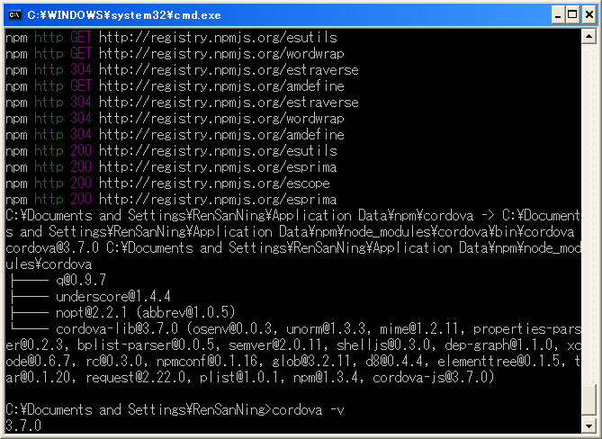
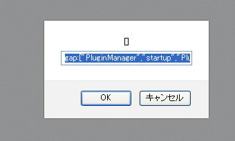

# Cordova 3.x 基础（1） -- 环境搭建（Windows / Android）

Mobile App 分为三大类：Native App,Hybrid App,Web App。其中 Hybrid App 介于 Native App 和 Web App 之间，它能兼顾 Native App 的良好用户体验及强大的功能并具有 Web App 跨平台快速开发的优势。缺点在于依赖于各平台的 WebView，WebView 的性能好坏直接决定了 Hybrid App 的性能。 

目前国内外的 Hybrid App 开发框架很多，比较有代表的是国外的 [Cordova](http://cordova.apache.org/)(aka [PhoneGap](http://phonegap.com/))、[Sencha Touch](http://www.sencha.com/products/touch/)、[Titanium](http://www.appcelerator.com/)、[Intel XDK](https://software.intel.com/en-us/html5/tools)、[RhoMobile](http://www.rhomobile.com/blog/)、[Xamarin](http://xamarin.com/) 等和国内的 [AppCan](http://www.appcan.cn/)、[Rexsee](http://www.rexsee.com/index.html)、[xFace](http://www.xface3.com/)，而 Dr. Dobb's Journal 颁布的[2014年度移动开发工具类 Jolt 大奖](http://www.infoq.com/cn/news/2014/03/jolt-mobile-tools)中 PhoneGap 和 Titanium 获得 Jolt 生产力奖。Titanium 应该属于 Web 到 Native 的 Converter，还有一种就是 Native JavaScript 的应用，比如 Chrome Apps／Firefox OS／Windows 8 apps。 

基于开源的 Cordova，各大公司都推出了自己的产品，比如：Adobe PhoneGap、Oracle ADF Mobile、SAP Kapsel、IBM Worklight、Microsoft 的 Visual Studio 也支持 Cordova。 

## 安装运行 

（1）前提环境   
安装 [Ant](http://ant.apache.org/)，把%ANT_HOME%\bin 加到 Path 环境变量中，不然会报 Error “executing command 'ant'”错。 

**引用**

```    
ant -h 
ant -version
```


安装 [Android SDK](http://developer.android.com/sdk/index.html)，把%ANDROID_HOME%\tools;%ANDROID_HOME%\platform-tools 加到 Path 环境变量中，不然会报"Error: An error occurred while listing Android targets"错，并提前创建好一个 AVD。 

关于 API 版本： 

- 3.0需要的是 android-17（Android 4.2.2）
- 3.1和3.2需要 android-18（Android 4.3）
- 3.3和3.4需要 android-19（Android 4.4.2）

**引用**

```
android -h 
adb version 
android list avd
```

安装 [Node.js](http://nodejs.org/) 

**引用**

```
node -v 
npm -v
```

如果需要从 git 地址安装插件，好需要安装 [Git](http://git-scm.com/) 

**引用**

```
git --version
```

（2）安装 Cordova CLI 

**引用**

```
> npm install -g cordova
```


安装路径：   
C:\Documents and Settings\RenSanNing\Application Data\npm\node_modules\cordova



更新 Cordova 版本 

**引用**

```
npm update cordova -g
```


如果安装速度很慢的话可以设置代理： 

**引用**

```
npm config set proxy http://xx.xx.xx.xx:xxxx 
npm config set https-proxy http://xx.xx.xx.xx:xxxx 
npm config list
```

或者使用国内的镜像站：[http://cnpmjs.org](http://cnpmjs.org/) 

**引用**

```
npm config set registry http://registry.cnpmjs.org 
npm info cordova 

npm --registry http://registry.cnpmjs.org info cordova
```
 
**现在最新版本：3.7.0（2014/10/01 发布） **

（3）创建并运行project 

a.新建一个目录 pro，并进入 

**引用**

```
> cd C:\pro
```

b.创建一个“myapp”工程 

**引用**

```
> cordova create myapp com.yourname.myapp MyApp
```

c.进入工程目录 

**引用**
```
> cd myapp
```

d.添加平台支持 

**引用**

```
> cordova platforms add ios 
> cordova platforms add android 

> cordova platforms ls
```
 
CLI 使用各个平台的 SDK 来创建工程。 

更新 Cordova 工程的版本   
**cordova platform check**   
如果有类似“android @ 3.3.0 could be updated to: 3.4.0”的提示可以执行更新   
也可以查看 platforms\android\assets\www\cordova.js 确认当前版本信息   
**cordova platform update android**   
如果提示“All platforms are up-to-date.”说明不需要更新。   

e.添加插件 

**引用**

```
> cordova plugin add org.apache.cordova.device 
> cordova plugin add org.apache.cordova.console 

> cordova plugin ls
```

插件可以从很多地方安装：   
插件名（从 plugin repository 下载）：cordova plugin add org.apache.cordova.console    
git 地址：cordova plugin add https://git-wip-us.apache.org/repos/asf/cordova-plugin-camera.git   
本地地址：cordova plugin add d:\cordova-3.3.0\cordova-plugin-camera   
本地文件：cordova plugin add plugin.tar.gz   
指定版本   
cordova plugin add org.apache.cordova.console@0.2.1   
cordova plugin add https://github.com/apache/cordova-plugin-console.git#r0.2.0   
cordova plugin add https://github.com/someone/aplugin.git#:/my/sub/dir   
cordova plugin add https://github.com/someone/aplugin.git#r0.0.1:/my/sub/dir   
等等 

f.编译代码 

**引用**

```
> cordova build android
```

g.运行代码 

在模拟器上运行（前提是创建好 AVD） 

**引用**

```
> cordova emulate android
```

Windows 下 convert 命令冲突，直接“cordova emulate android”会报 Error: spawn ENOENT，需要先启动模拟器。 

h.在浏览器运行 

**引用**

```
> cordova serve android
```

浏览器访问地址：http://localhost:8000/，就可以和调试页面一样调试 app 的布局了。如果 app 中使用了 cordova 的 Native API 调用，会弹出以下对话框： 



这是因为浏览器无法提供@JavascriptInterface 的接口，Cordova 视图通过 prompt()和 Native 交互，这样做是因为 [Android2.3 simulator 的 Bug](https://code.google.com/p/android/issues/detail?id=12987)。所以调试页面布局，无视即可。 

i.通过 USB 直接安装到真机 

**引用**

```
> cordova run android
```

Cordova CLI 采用 Lazy Loading 的方式，当你创建 Cordova 工程、添加平台支持，安装插件等等的时候从服务器上下载相应的文件解压到相应的文件夹中。lazy-loaded 的文件存放在系统用户的文件夹下，比如 Windows XP 是C:\Documents and 
Settings\RenSanNing\.cordova。所以第一次使用的时候会比较慢。 

## 常用命令 

（1）create <directory> [<id> [<name>]]   
创建一个 cordova 工程，id 为 package 名。 

（2）platform [ls | list]   
列出该工程支持哪些平台 

（3）platform add <platform> [<platform> ...]   
为工程添加一个或多个平台支持 

（4）platform [rm | remove] <platform> [<platform> ...]   
删除该工程的某个平台支持 

（5）platform [up | update] <platform>   
更新该工程某个平台的 Cordova 版本 

（6）plugin [ls | list]   
列出该工程包含哪些插件 

（7）plugin add <path-to-plugin> [<path-to-plugin> ...]   
为工程添加一个或多个插件 

（8）plugin [rm | remove] <plugin-name> [<plugin-name> ...]   
从该工程中删除某个插件 

（9）plugin search [<keyword1> <keyword2> ...]   
根据关键字从 registry 中搜索插件 

（10）compile [platform...]   
编译指定平台的 app 包 

（11）build [<platform> [<platform> [...]]]   
先做 prepare（拷贝文件）后做 compile 

（12）emulate [<platform> [<platform> [...]]]   
启动模拟器运行应用 

（13）serve [port]   
启动本地 web 服务来访问 www，默认端口是8000 

**引用**

    platform 和 platforms 等价 
    plugin 和 plugins 等价


详细的内容可以通过 cordova help 命令查看。 

## 目录结构 

（1）目录一览：

**引用**

	myApp/ 
	|-- config.xml 
	|-- hooks/ 
	| | |-- before_xxx/ 
	| | `-- after_xxx/ 
	|-- merges/ 
	| | |-- android/ 
	| | `-- ios/ 
	|-- platforms/ 
	| |-- android/ 
	| `-- ios/ 
	|-- plugins/ 
	| |-- org.apache.cordova.console/ 
	| `-- org.apache.cordova.device/ 
	|-- www/ 
	| |-- css/ 
	| |-- img/ 
	` |-- js/ 
	  `-- index.html

（2）config.xml   
cordova 的配置文件 

（3）hooks 目录   
存放自定义 cordova 命令的脚本文件。每个 project 命令都可以定义 before 和 after 的 Hook，比如：before_build、after_build。   
Hook 可以采用任何编程语言来写，Cordova CLI 采用的是 Node.js，所以一般都是用它来写。 

这里提供了3个常用的 Hook 脚本：   
[http://devgirl.org/2013/11/12/three-hooks-your-cordovaphonegap-project-needs/](http://devgirl.org/2013/11/12/three-hooks-your-cordovaphonegap-project-needs/) 

（4）merges 目录   
存放各个平台特殊的文件，会和 www 进行合并编译，相同的文件 merges 下的文件优先。 

比如： 

**引用**
	
	merges/ 
	|-- ios/ 
	| `-- app.js 
	|-- android/ 
	| `-- android.js 
	www/ 
	`-- app.js

编译成 iOS 应用的话，包含 merges/ios/app.js；而 Android 应用的话，包含 www/app.js、merges/android/android.js

（5）platforms 目录   
各个平台的原生代码工程，不要手动修改，因为在 build 的时候会被覆盖。 

（6）plugins 目录   
插件目录（cordova 提供的原生 API 也是以插件的形式提供的）。 

（7）www 目录   
源代码目录，在 cordova prepare 的时候会被 copy 到各个平台工程的 assets\www 目录中。 
其中 index.html 为应用的入口文件。 

更多：[http://cordova.apache.org/docs/en/3.4.0/index.html](http://cordova.apache.org/docs/en/3.4.0/index.html)