# Cordova 3.x 基础（7） -- Native API 的使用

移动设备的 Hardware 接口包括：Accelerometer、Camera、Capture、Compass、Connection、Contacts、Device、Native Events、File、Geolocation、Notification、Storage、Gestures/Multitouch、Messages/Telephone、Bluetooth、NFC、Vibration。Cordova 的 Native API 接口调用很简单，这里列举一下常用的 API 调用方法，由于 Cordova 只是个 Container，所以 UI 使用 jQuery Mobile（Single Page、脚本嵌入 page div 内部）。使用“Cordova ：3.4.0、 Andorid ：4.1.1”平台测试通过。完整的源代码：[www.rar](http://dl.iteye.com/topics/download/c3df096c-b5e8-3647-8023-aeab0983421d)，Android APK文件：[CordovaSample-debug-unaligned.apk](http://dl.iteye.com/topics/download/6dc83a83-0d2e-3253-a55d-2f7985779fd7) 

##（1）主页面 

Html **代码**

```
<!-- Main -->
<div data-role="page" id="main">
  <div data-role="header">
    <h1>Cordova Sample</h1> 
  </div>
  <div data-role="content">
    <ul data-role="listview">
      <li><a href="#accelerometer" data-transition="slide">Accelerometer</a></li>
      <li><a href="#camera" data-transition="slide">Camera</a></li>
      <li><a href="#compass" data-transition="slide">Compass</a></li>
      <li><a href="#connection" data-transition="slide">Connection</a></li>
      <li><a href="#device" data-transition="slide">Device</a></li>
      <li><a href="#geolocation" data-transition="slide">Geolocation</a></li>
      <li><a href="#notification" data-transition="slide">Notification</a></li>
      <li><a href="#contacts" data-transition="slide">Contacts</a></li>
      <li><a href="#file" data-transition="slide">File</a></li>
      <li><a href="#inAppBrowser" data-transition="slide">InAppBrowser</a></li>
      <li><a href="#storage" data-transition="slide">Storage</a></li>
      <li><a href="#database" data-transition="slide">Database</a></li>
    </ul>
  </div>
</div>
```

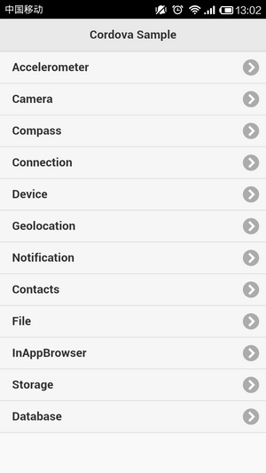

## （2）Accelerometer(加速计传感器) 

Html **代码**

```
<!-- Accelerometer 
      $ cordova plugin add org.apache.cordova.device-motion
-->
<div data-role="page" id="accelerometer">
  <div data-role="header">
    <a data-role="button" data-rel="back" data-direction="reverse" data-icon="arrow-l">Back</a>
    <h1>Accelerometer</h1> 
  </div>
  <div data-role="content">
      <a href="#" data-role="button" id="startWatch">Start Watching</a><br>
      <a href="#" data-role="button" id="stopWatch">Stop Watching</a><br>
      <div id="accvals">Waiting for accelerometer...</div>
      <br><br>
      <a href="#" data-role="button" id="startWatchOrientation">Start Watch Orientation</a><br>
      <a href="#" data-role="button" id="stopWatchOrientation">Stop Watch Orientation</a><br>
      <div id="orivals">Waiting for orientation...</div>
  </div>
  <script type="text/javascript">
    var watchID = null;

    document.addEventListener('deviceready', onDeviceReady, false);
    function onDeviceReady() {
      $("#startWatch").on("click", startWatch);
      $("#stopWatch").on("click", stopWatch);
      $("#startWatchOrientation").on("click", startWatchOrientation);
      $("#stopWatchOrientation").on("click", stopWatchOrientation);
    }

    function startWatch() {
      alert("startWatch");

      var options = { frequency: 3000 };
      watchID = navigator.accelerometer.watchAcceleration(onAccelSuccess, onAccelError, options);
    }

    function stopWatch() {
      alert("stopWatch");

      if (watchID) {
        navigator.accelerometer.clearWatch(watchID);
        watchID = null;
      }
    }

    function onAccelSuccess(acceleration) {
      var element = document.getElementById('accvals');
      element.innerHTML = '<strong>Accel X:</strong> ' + acceleration.x.toFixed(1) * -1 + '<br />' +
                          '<strong>Accel Y:</strong> ' + acceleration.y.toFixed(1) + '<br />' +
                          '<strong>Accel Z:</strong> ' + acceleration.z.toFixed(1) + '<br />' +
                          '<strong>Timestamp:</strong> ' + acceleration.timestamp + '<br />';
    }

    function onAccelError() {
      alert('Could not Retrieve Accelerometer Data!');
    }

    function deviceOrientationEvent(eventData) {
      var alpha = Math.round(eventData.alpha);
      var beta = Math.round(eventData.beta);
      var gamma = Math.round(eventData.gamma);
      var element = document.getElementById('orivals');
      element.innerHTML = ("alpha = " + alpha + " beta = " + beta + " gamma = " + gamma);
    }
    function startWatchOrientation() {
      alert("startWatchOrientation");
      window.addEventListener('deviceorientation', deviceOrientationEvent);
    }
    function stopWatchOrientation() {
      alert("stopWatchOrientation");
      window.removeEventListener('deviceorientation', deviceOrientationEvent);
    }
  </script>
</div>
```

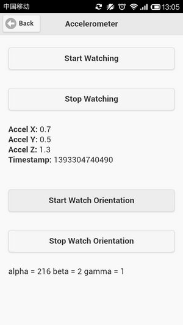

## （3）Camera (摄像头) 

Html 代码 

```
<!-- Camera 
      $ cordova plugin add org.apache.cordova.camera
-->
<div data-role="page" id="camera">
  <div data-role="header">
    <a data-role="button" data-rel="back" data-direction="reverse" data-icon="arrow-l">Back</a>
    <h1>Camera</h1> 
  </div>
  <div data-role="content">
      <a href="#" data-role="button" id="capturePhoto">Capture Photo</a><br>
      <p id="smTitle"></p>
      <a href="#" data-role="button" id="browsePhoto">Browse Photo Album</a><br>
      <p id="lgTitle"></p>
  </div>
  <script type="text/javascript">
    var pictureSource;
    var destinationType; //

    document.addEventListener('deviceready', onDeviceReady, false);
    function onDeviceReady() {
      pictureSource = navigator.camera.PictureSourceType;
      destinationType = navigator.camera.DestinationType;

      $("#capturePhoto").on("click", capturePhoto);
      $("#browsePhoto").on("click", browsePhoto);
    }

    function capturePhoto() {
      alert("capturePhoto");

      if (!navigator.camera) {
          alert("Camera API not supported", "Error");
          return;
      }
      navigator.camera.getPicture(onPhotoDataSuccess, onFail, 
          { quality: 50, 
            allowEdit: true, 
            destinationType: destinationType.DATA_URL });
    }

    function browsePhoto() {
      alert("browsePhoto");

      navigator.camera.getPicture(onPhotoURISuccess, onFail, 
          { quality: 50,
            destinationType: destinationType.FILE_URI,
            sourceType: pictureSource.PHOTOLIBRARY });
    }
    //sourceType 0:Photo Library, 1=Camera, 2=Saved Album
    //encodingType 0=JPG 1=PNG

    function onFail(message) {
      alert('Response: ' + message);
    }

    function onPhotoDataSuccess(imageData) {
      var smallImage = document.getElementById('smallImage');
      smallImage.style.display = 'block';
      smallImage.src = "data:image/jpeg;base64," + imageData;
    }

    function onPhotoURISuccess(imageURI) {
      var largeImage = document.getElementById('largeImage');
      largeImage.style.display = 'block';
      largeImage.src = imageURI;
    }
  </script>
</div>
```

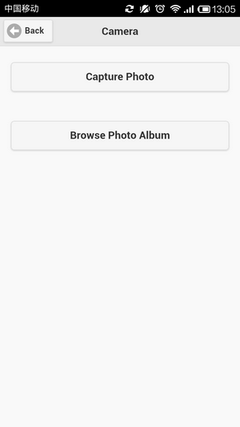

#3 （4）Compass(罗盘) 

Html **代码**

```
<!-- Compass 
      $ cordova plugin add org.apache.cordova.device-orientation
-->
<div data-role="page" id="compass">
  <div data-role="header">
    <a data-role="button" data-rel="back" data-direction="reverse" data-icon="arrow-l">Back</a>
    <h1>Compass</h1> 
  </div>
  <div data-role="content">
      <a href="#" data-role="button" id="startWatchCompass">Start Watch Compass</a><br>
      <a href="#" data-role="button" id="stopWatchCompass">Stop Watch Compass</a><br>
      <div id="heading">Waiting for heading...</div>
  </div>
  <script type="text/javascript">
    var watchIDCompass = null;

    document.addEventListener("deviceready", onDeviceReady, false);
    function onDeviceReady() {
      $("#startWatchCompass").on("click", startWatchCompass);
      $("#stopWatchCompass").on("click", stopWatchCompass);
    }
    function startWatchCompass() {
      alert("startWatchCompass");

      var options = { frequency: 3000 };
      watchIDCompass = navigator.compass.watchHeading(onCompassSuccess, onCompassError, options);
    }
    function stopWatchCompass() {
      alert("stopWatchCompass");

      if (watchIDCompass) {
        navigator.compass.clearWatchCompass(watchIDCompass);
        watchIDCompass = null;
      }
    }
    function onCompassSuccess(heading) {
     var element = document.getElementById('heading');
      element.innerHTML = 'Current Heading: ' + (heading.magneticHeading).toFixed(2);
    }
    function onCompassError(compassError) {
      alert('Compass error: ' + compassError.code);
    }
  </script>
</div>
```

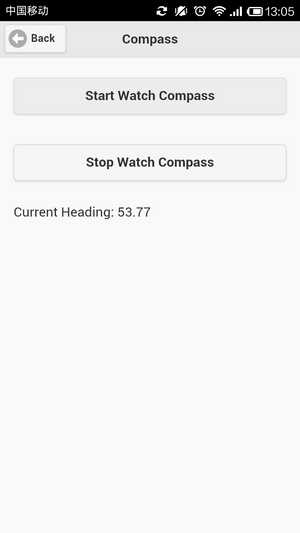

## （5）Connection(网络连接状态) 

Html **代码**

```
<!-- Connection 
      $ cordova plugin add org.apache.cordova.network-information
-->
<div data-role="page" id="connection">
  <div data-role="header">
    <a data-role="button" data-rel="back" data-direction="reverse" data-icon="arrow-l">Back</a>
    <h1>Connection</h1> 
  </div>
  <div data-role="content">
      <a href="#" data-role="button" id="checkConnection">Check Connection</a><br>
      <div id="connectiontype">Waiting for Connection type...</div>
  </div>
  <script type="text/javascript">
    document.addEventListener("deviceready", onDeviceReady, false);
    function onDeviceReady() {
      $("#checkConnection").on("click", checkConnection);
    }

    function checkConnection() {
      alert("checkConnection");

      var networkState = navigator.connection.type;
      var states = {};
      states[Connection.UNKNOWN] = 'Unknown connection';
      states[Connection.ETHERNET] = 'Ethernet connection';
      states[Connection.WIFI] = 'WiFi connection';
      states[Connection.CELL_2G] = 'Cell 2G connection';
      states[Connection.CELL_3G] = 'Cell 3G connection';
      states[Connection.CELL_4G] = 'Cell 4G connection';
      states[Connection.CELL] = 'Cell generic connection';
      states[Connection.NONE] = 'No network connection';

      var element = document.getElementById('connectiontype');
      element.innerHTML = 'Connection type: ' + states[networkState];
    }
  </script>
</div>
```

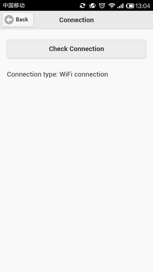

## （6）Device(设备信息) 

Html 代码

```
<!-- Device 
       $ cordova plugin add org.apache.cordova.device
-->
<div data-role="page" id="device">
  <div data-role="header">
    <a data-role="button" data-rel="back" data-direction="reverse" data-icon="arrow-l">Back</a>
    <h1>Device</h1> 
  </div>
  <div data-role="content">
      <a href="#" data-role="button" id="getDeviceProperties">Get Device Properties</a><br>
      <div id="deviceProperties">Loading device properties...</div>
  </div>
  <script type="text/javascript">
    document.addEventListener("deviceready", onDeviceReady, false);
    function onDeviceReady() {
      $("#getDeviceProperties").on("click", getDeviceProperties);
    }

    function getDeviceProperties() {
       alert("getDeviceProperties");

       var element = document.getElementById('deviceProperties');
       element.innerHTML = 'Device Model (Android: product name): ' + device.model + '<br />' +
       'Cordova version: ' + device.cordova + '<br />' +
       'Operating system: ' + device.platform + '<br />' +
       'Device UUID: ' + device.uuid + '<br />' +
       'Operating system version: ' + device.version + '<br />';
    }
  </script>
</div>
```

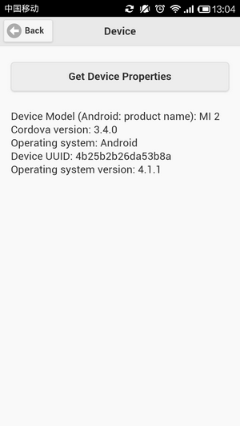

## （7）Geolocation(GPS 地理位置服务) 

Html **代码** 

```
<!-- Geolocation 
      $ cordova plugin add org.apache.cordova.geolocation
-->
<div data-role="page" id="geolocation">
  <div data-role="header">
    <a data-role="button" data-rel="back" data-direction="reverse" data-icon="arrow-l">Back</a>
    <h1>Geolocation</h1> 
  </div>
  <div data-role="content">
    <a href="#" data-role="button" id="startGeolocationg">Start Geolocationg</a><br>
    <a href="#" data-role="button" id="stopGeolocationg">Stop Geolocation</a><br>
    <br><br>
    <a href="#" data-role="button" id="getCurrentPosition">Get Current Position </a><br>
    <div id="geovals">Waiting for geolocation...</div>
  </div>
  <script type="text/javascript">
    var watchGeoID = null;

    document.addEventListener("deviceready", onDeviceReady, false);
    function onDeviceReady() {
      $("#startGeolocationg").on("click", startGeolocationg);
      $("#stopGeolocationg").on("click", stopGeolocationg);
      $("#getCurrentPosition").on("click", getCurrentPosition);
    }

    function startGeolocationg() {
      alert('startGeolocationg');
      var element = document.getElementById('geovals');
      element.innerHTML = 'Finding geolocation every 30 seconds...'
      var options = { enableHighAccuracy: true, timeout: 30000 };
      watchGeoID = navigator.geolocation.watchPosition(onGeoSuccess, onGeoError, options);
    }

    function onGeoSuccess(position) {
      var element = document.getElementById('geovals');
      element.innerHTML = 
      '<strong>Latitude:</strong> ' + position.coords.latitude + '<br />' +
      '<strong>Longitude: </strong> ' + position.coords.longitude + ' <br />' +
      '<strong>Altitude</strong> (in meters): ' + position.coords.altitude + ' <br />' +
      '<strong>Accuracy</strong> (in meters): ' + position.coords.accuracy + ' <br />' +
      '<strong>Altitude Accuracy:</strong> ' + position.coords.altitudeAccuracy + ' <br />' +
      '<strong>Heading</strong> (direction of travel): ' + position.coords.heading + ' <br />' +
      '<strong>Speed</strong> (meters per second): ' + position.coords.speed + ' <br />' +
      '<strong>Timestamp:</strong> ' + position.timestamp + ' <br />';
    }
    function onGeoError(error) {
      var element = document.getElementById('geovals');
      element.innerHTML =+ '<br>' + error.code + error.message;
    }

    function stopGeolocationg() {
      alert('stopGeolocationg');

      var element = document.getElementById('geovals');
      element.innerHTML = '<span style="color:red">Geolocation turned off.</span>';
      if (watchGeoID) {
        navigator.geolocation.clearWatch(watchGeoID);
        watchGeoID = null;
      }
    }

    function getCurrentPosition() {
      alert('getCurrentPosition');
      navigator.geolocation.getCurrentPosition(onPositionSuccess, onPositionError);
    }
    function onPositionSuccess(position) {
      var element = document.getElementById('geovals');
      element.innerHTML =+ ('Latitude: ' + position.coords.latitude + '\n' + 
                            'Longitude: ' + position.coords.longitude + '\n'); 
    };
    function onPositionError(error) {
      var element = document.getElementById('geovals');
      element.innerHTML =+('Error getting GPS Data');
    }
  </script>
</div>
```

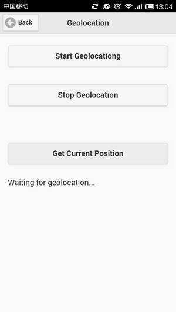

## （8）Notification(消息提示) 

Html **代码**

```
<!-- Notification 
      $ cordova plugin add org.apache.cordova.dialogs
      $ cordova plugin add org.apache.cordova.vibration
-->
<div data-role="page" id="notification">
  <div data-role="header">
    <a data-role="button" data-rel="back" data-direction="reverse" data-icon="arrow-l">Back</a>
    <h1>Notification</h1> 
  </div>
  <div data-role="content">
    <a href="#" data-role="button" id="showAlert">Show Alert popup</a><br>
    <a href="#" data-role="button" id="showConfirm">Show Confirm popup</a><br>
    <a href="#" data-role="button" id="showPrompt">Show Prompt popup</a><br>
    <br><br>
    <a href="#" data-role="button" id="playBeep">Play Beep sound</a><br>
    <a href="#" data-role="button" id="vibrate">Vibrate the device</a><br>
  </div>
  <script type="text/javascript">
    var watchGeoID = null;

    document.addEventListener("deviceready", onDeviceReady, false);
    function onDeviceReady() {
      $("#showAlert").on("click", showAlert);
      $("#showConfirm").on("click", showConfirm);
      $("#showPrompt").on("click", showPrompt);
      $("#playBeep").on("click", playBeep);
      $("#vibrate").on("click", vibrate);
    }

    function showAlert() {
      navigator.notification.alert(
        'Alert dialog: You are on fire!',
        alertDismissed, //callback
        'Game Over',
        'Done'
      );
    }
    /*
    // Override default HTML alert with native dialog
    document.addEventListener('deviceready', function () {
        if (navigator.notification) { 
            window.alert = function (message) {
                navigator.notification.alert(
                    message,
                    null,
                    "My App",
                    'OK'
                );
            };
        }
    }, false);
    */
    function alertDismissed() {
      alert('You dismissed the Alert.');
    }
    function onConfirm(buttonIndex) {
      alert('You selected button ' + buttonIndex + '\n(button 1 = Restart, button 2 = Exit.)');
    }
    function showConfirm() {
      navigator.notification.confirm(
        'Confirm dialog: You are the winner!',
        onConfirm,
        'Game Over',
        ['Restart','Exit']
      );
    }
    function onPrompt(results) {
      alert("You selected button number " + results.buttonIndex + " and entered " + results.input1 + '\n(button 2 = Exit, button 1 = OK.)');
    }
    function showPrompt() {
      navigator.notification.prompt(
        'Please enter your name',
        onPrompt,
        'Registration',
        ['Ok','Exit'],
        'Jane Doe?'
      );
    }
    function playBeep() {
      navigator.notification.beep(3);
    }
    function vibrate() {
      navigator.notification.vibrate(2000);
    }
  </script>
</div>
```

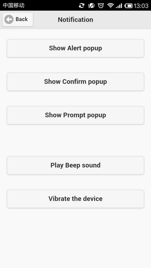

## （9）Contacts(联系人) 

Html **代码**

```
<!-- Contacts 
        $ cordova plugin add org.apache.cordova.contacts
-->
<div data-role="page" id="contacts">
  <div data-role="header">
    <a data-role="button" data-rel="back" data-direction="reverse" data-icon="arrow-l">Back</a>
    <h1>Contacts</h1> 
  </div>
  <div data-role="content">
    <label for="fname">First Name:</label>
    <input type="text" name="fname" id="fname" value="REN"><br>
    <label for="lname">Last Name:</label>
    <input type="text" name="lname" id="lname" value="SANNING"><br>
    <label for="email">Email:</label>
    <input type="text" name="email" id="email" value="rensanning@gmail.com"><br>
    <label for="tel">TEL:</label>
    <input type="text" name="tel" id="tel" value="18812345678"><br>
    <br>
    <a href="#" data-role="button" id="saveContacts">Save</a><br>
  </div>
  <script type="text/javascript">

    document.addEventListener("deviceready", onDeviceReady, false);
    function onDeviceReady() {
      $("#saveContacts").on("click", saveContacts);
    }

    function saveContacts() {
      alert('saveContacts');

      if (!navigator.contacts) {
          alert("Contacts API not supported", "Error");
          return;
      }
      var contact = navigator.contacts.create();
      var name = new ContactName();
      name.givenName = $('#fname').val();
      name.familyName = $('#lname').val();
      contact.name = name;
      contact.displayName = $('#fname').val() + " " + $('#lname').val();
      contact.emails = [new ContactField('home', $('#email').val(), false)];
      contact.phoneNumbers = [new ContactField('home', $('#tel').val(), false)];
      contact.save(
        function() {
          alert("OK!");
        },
        function() {
          alert("Error!");
        }
      );
    }
  </script>
</div>
```

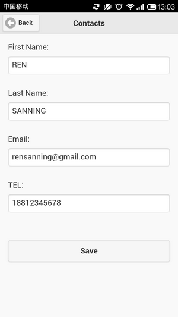

## （10）File(文件系统处理 ) 

Html **代码**

```
<!-- File 
        $ cordova plugin add org.apache.cordova.file
        $ cordova plugin add org.apache.cordova.file-transfer
-->
<div data-role="page" id="file">
  <div data-role="header">
    <a data-role="button" data-rel="back" data-direction="reverse" data-icon="arrow-l">Back</a>
    <h1>File</h1> 
  </div>
  <div data-role="content">
    <input type="text" id="userInput" name="userInput" value="I'm rensanning."><br>
    <a href="#" data-role="button" id="writeToFile">Write To File</a><br>

    <a href="#" data-role="button" id="readFile">Read File</a><br>
    <p id="data1"></p><p id="data2"></p><br>

    <a href="#" data-role="button" id="deleteFile">Delete File</a><br>
  </div>
  <script type="text/javascript">

    document.addEventListener("deviceready", onDeviceReady, false);
    function onDeviceReady() {
      $("#writeToFile").on("click", writeToFile);
      $("#readFile").on("click", readFile);
      $("#deleteFile").on("click", deleteFile);
    }

    function writeToFile() {
      window.requestFileSystem(LocalFileSystem.PERSISTENT, 0, gotFSForWrite, fail);
    }
    function gotFSForWrite(fileSystem) {
      fileSystem.root.getFile("CordovaSample.txt", {create: true, exclusive: false}, gotWriteFileEntry, fail);
    }
    function gotWriteFileEntry(fileEntry) {
      fileEntry.createWriter(gotFileWriter, fail);
    }
    function gotFileWriter(writer) {
     var userText = $('#userInput').val();
     writer.seek(writer.length);
     writer.write('\n\n' + userText);
     writer.onwriteend = function(evt){
       alert("You wrote ' " + userText + " ' at the end of the file.");
     } 
     $('#userInput').val("");
    }

    function readFile() {
      window.requestFileSystem(LocalFileSystem.PERSISTENT, 0, gotFSForRead, fail);
    }
    function gotFSForRead(fileSystem) {
      fileSystem.root.getFile("CordovaSample.txt", null, gotReadFileEntry, fail);
    }
    function gotReadFileEntry(fileEntry) {
      fileEntry.file(gotFileRead, fail);
    }
    function gotFileRead(file){
      readDataUrl(file);
      readAsText(file);
    }
    function readDataUrl(file) {
      var reader = new FileReader();
      reader.onloadend = function(evt) {
        var element = document.getElementById('data1');
        element.innerHTML = '<strong>Read as data URL:</strong> <br><pre>' + evt.target.result + '</pre>';
      };
      reader.readAsDataURL(file);
    }
    function readAsText(file) {
      var reader = new FileReader();
      reader.onloadend = function(evt) {
        var element = document.getElementById('data2');
        element.innerHTML = '<strong>Read as data text:</strong> <br><pre>' + evt.target.result + '</pre>';
      };
      reader.readAsText(file);
    }

    function deleteFile() {
      window.requestFileSystem(LocalFileSystem.PERSISTENT, 0, gotFSForRemove, fail);
    }
    function gotFSForRemove(fileSystem) {
      fileSystem.root.getFile("CordovaSample.txt", {create: false, exclusive: false}, gotRemoveFileEntry, fail);
    }
    function gotRemoveFileEntry(fileEntry){
      fileEntry.remove(
        function(entry) {
          alert("Removal succeeded");
        }, 
        function(error) {
          alert("Error removing file: " + error.code);
      });
    }

    function fail(error) {
      alert(error.code);
    }
  </script>
</div>
```

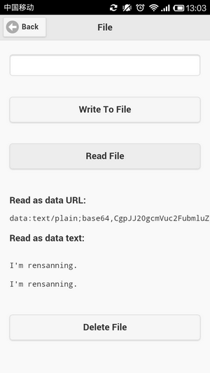

## （11）InAppBrowser(Web 浏览) 

Html **代码**

```
<!-- InAppBrowser
        $ cordova plugin add org.apache.cordova.inappbrowser
-->
<div data-role="page" id="inAppBrowser">
  <div data-role="header">
    <a data-role="button" data-rel="back" data-direction="reverse" data-icon="arrow-l">Back</a>
    <h1>InAppBrowser</h1> 
  </div>
  <div data-role="content">
    <label for="url">URL:</label>
    <input type="text" id="url" name="url" value="http://www.baidu.com"><br>
    <a href="#" data-role="button" id="openURL">Open URL</a><br>
  </div>
  <script type="text/javascript">
    document.addEventListener("deviceready", onDeviceReady, false);
    function onDeviceReady() {
      $("#openURL").on("click", openURL);
    }

    function openURL() {
      alert('openURL');

      var ref = window.open($('#url').val(), '_blank', 'location=yes');
      ref.addEventListener('loadstart', function(event) { alert('start: ' + event.url); });
      ref.addEventListener('loadstop', function(event) { alert('stop: ' + event.url); });
      ref.addEventListener('loaderror', function(event) { alert('error: ' + event.message); });
      ref.addEventListener('exit', function(event) { alert(event.type); });
    }
  </script>
</div>
```

  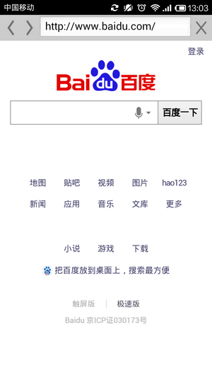

## （12）Storage(数据存储) 

Html **代码**

```
<!-- Storage -->
<div data-role="page" id="storage">
  <div data-role="header">
    <a data-role="button" data-rel="back" data-direction="reverse" data-icon="arrow-l">Back</a>
    <h1>Storage</h1> 
  </div>
  <div data-role="content">
    <label for="key">Key:</label>
    <input type="text" id="key" name="key" value="item_name"><br>
    <label for="val">Value:</label>
    <input type="text" id="val" name="val" value="item_value"><br>
    <a href="#" data-role="button" id="saveItem">Save Item</a><br>
    <a href="#" data-role="button" id="getItem">Get Item</a><br>
    <a href="#" data-role="button" id="deleteItem">Delete Item</a><br>
  </div>
  <script type="text/javascript">
    document.addEventListener("deviceready", onDeviceReady, false);
    function onDeviceReady() {
      $("#saveItem").on("click", saveItem);
      $("#getItem").on("click", getItem);
      $("#deleteItem").on("click", deleteItem);
    }

    function saveItem() {
      alert('saveItem');
      window.localStorage.setItem($('#key').val(), $('#val').val());
    }
    function getItem() {
      alert('getItem');
      var item_value = window.localStorage.getItem($('#key').val());
      alert(item_value);
    }
    function deleteItem() {
      alert('deleteItem');
      window.localStorage.removeItem($('#key').val());
    }
  </script>
</div>
```

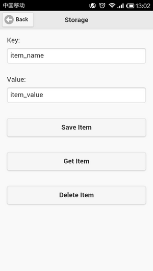

## （13）Database(客户端数据库) 

Html **代码**

```
<!-- Database -->
<div data-role="page" id="database">
  <div data-role="header">
    <a data-role="button" data-rel="back" data-direction="reverse" data-icon="arrow-l">Back</a>
    <h1>Database</h1> 
  </div>
  <div data-role="content">
    <label for="id">ID:</label>
    <input type="text" id="id" name="id" value="12345"><br>
    <label for="data">Data:</label>
    <input type="text" id="data" name="data" value="Data Value"><br>
    <a href="#" data-role="button" id="saveToDatabase">Save To Database</a><br>
    <a href="#" data-role="button" id="getFromDatabase">Get From Database</a><br>
  </div>
  <script type="text/javascript">
    var db;

    document.addEventListener("deviceready", onDeviceReady, false);
    function onDeviceReady() {
      $("#saveToDatabase").on("click", saveToDatabase);
      $("#getFromDatabase").on("click", getFromDatabase);

      db = window.openDatabase("MyDatabase", "1.0", "Cordova Sample", 200000);
      db.transaction(function(tx) {
          tx.executeSql('DROP TABLE IF EXISTS MyTable');
          tx.executeSql('CREATE TABLE IF NOT EXISTS MyTable (id unique, data)');
        }, 
        function(err) {
          alert("Error processing SQL: " + err.code);
        });
    }

    function saveToDatabase() {
      alert('saveToDatabase');

      db.transaction(function(tx) {
        tx.executeSql("INSERT INTO MyTable (id, data) VALUES (?, ?)",
                      [$('#id').val(), $('#data').val()],
                      function(tx, rs) {
                          alert("Your SQLite query was successful!");
                      },
                      function(tx, e) {
                          alert("SQLite Error: " + e.message);
                      });
      });
    }
    function getFromDatabase() {
      alert('getFromDatabase');

      db.transaction(function(tx) {
        tx.executeSql("SELECT id,data FROM MyTable ORDER BY id",
                      [],
                      function (tx, rs) {
                          for (var i = 0; i < rs.rows.length; i++) {
                              alert(rs.rows.item(i).id + "=" + rs.rows.item(i).data);
                          }
                      },
                      function(tx, e) {
                          alert("SQLite Error: " + e.message);
                      });
      });
    }
  </script>
</div>
```

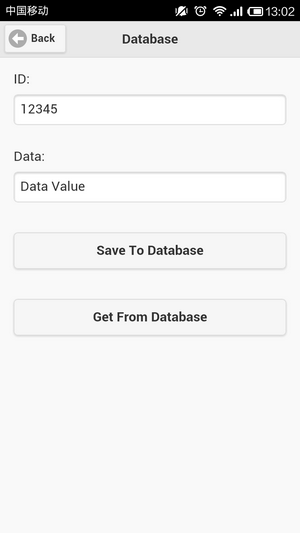

