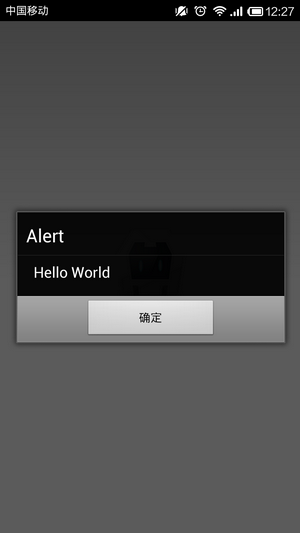
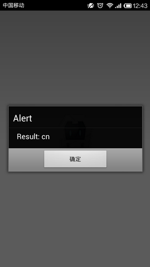
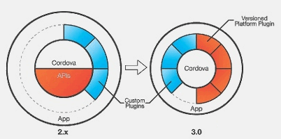

# Cordova 3.x 基础（12） -- Plugin 开发

Cordova 提供的功能能够满足一般应用，但是对于复杂的应用或者对性能要求比较严格的应用来说，并不是很理想的。所以就需要在某些场景下自己写代码来弥补这些不足，类似 Titanium Module 一样，Cordova 也提供了 Plugin 功能。Cordova 本身访问 Native 接口都是通过 Plugin 的方式提供的，可以参考官方 Plugin 代码，而且 GitHub 上也存在不少开源的 Cordova Plugin，所以这些都是最好的教程。 

Plugin 的分类大概有两种： 

- JavaScript-only Plugin：不需要写 Native 代码，不依赖平台的共通的 JS 代码
- Native Plugin：弥补 Cordova 提供的功能以外的 Native 调用，依赖各个平台写不同的 Native 代码


**（1）Plugin 构成 **

**引用**

```
|- plugin.xml 
|- www 
|   +- hello_world.js 
+- src 
    |- android 
    |     +- com/rensanning/cordova/plugin/HelloWorldPlugin.java 
    +- ios 
        |- HelloWorldPlugin.h 
        +- HelloWorldPlugin.m
```

**plugin.xml** ： 必须。通知 CLI 哪个平台应该从什么地方 Copy 哪些文件到什么地方，以及 CLI 在生成 config.xml 时应该根据平台加入什么样的特殊设置。   
**JavaScript 文件** : 必须。一个 Plugin 至少应该有一个 JS 文件，也可以引入其他的 lib（比如：handlebars.js），定义为 js-module，会被 cordova.js 会自动读入。   
**原生代码** ：可选。   
**静态文件** ： 可选。HTML、图像等 

其中 plugin.xml 文件配置如下： 

Xml **代码**

```
<plugin xmlns="http://apache.org/cordova/ns/plugins/1.0"
    xmlns:rim="http://www.blackberry.com/ns/widgets"
    xmlns:android="http://schemas.android.com/apk/res/android"
    id="org.apache.cordova.device"
    version="0.2.8">
    <name>Device</name>
    <description>Cordova Device Plugin</description>
    <license>Apache 2.0</license>
    <keywords>cordova,device</keywords>
    <repo>https://git-wip-us.apache.org/repos/asf/cordova-plugin-device.git</repo>
    <issue>https://issues.apache.org/jira/browse/CB/component/12320648</issue>

    <js-module src="www/device.js" name="device">
        <clobbers target="device" />
    </js-module>

    <!-- android -->
    <platform name="android">
        <config-file target="res/xml/config.xml" parent="/*">
            <feature name="Device" >
                <param name="android-package" value="org.apache.cordova.device.Device"/>
            </feature>
        </config-file>

        <source-file src="src/android/Device.java" target-dir="src/org/apache/cordova/device" />
    </platform>

    <!-- 其他平台的代码 -->
</plugin>
```

plugin -- 命名空间、ID、版本   
name -- 名称   
description -- 描述   
keywords -- 关键字   
engines -- Cordova 版本   
js-module -- js 文件地址，会被默认加载到首页面（index.html），通过 clobbers 元素的定义把就是的 module.exports 自定赋给 window 对象。   
platform -- 各个平台设置   

**（2）创建 JS Plugin**

文件夹结构： 

**引用**

```
sample 
│  plugin.xml 
│ 
└─www 
        hello_world.js
```


plugin.xml： 

Xml **代码**

```
<?xml version="1.0" encoding="UTF-8"?>
<plugin xmlns="http://apache.org/cordova/ns/plugins/1.0"
    id="com.rensanning.cordova.helloworld"
    version="0.0.1">
    <name>HelloWorldPlugin</name>
    <description>HelloWorldPlugin Description</description>
    <author>rensanning</author>
    <license>Apache 2.0 License</license>
    <engines>
        <engine name="cordova" version=">=3.0.0" />
    </engines>
    <js-module src="www/hello_world.js" name="helloworld">
        <clobbers target="HelloWorld" />
    </js-module>
</plugin>
```

hello_world.js： 

Js **代码**

```
var HelloWorld = function() {};

HelloWorld.prototype.say = function() {
    alert("Hello World");
};

var helloWorld = new HelloWorld();
module.exports = helloWorld;
```

创建工程测试 Plugin： 

**引用**

```
cordova create simplePlugin com.rensanning.cordova.simplePlugin SimplePlugin 
cd simplePlugin 
cordova platform add android 
cordova plugin add E:\plugins\sample
```

修改 index.html 后启动测试即可。 

Html **代码**

```
<button onclick="test();">Click me!</button>
<script type="text/javascript">
  function test() {
      HelloWorld.say();
  }
</script>
```



**（3）创建 Native Plugin** 

以 Android 下获取 Carrier Code 为例。 

文件夹结构： 

**引用**

	carrier 
	│  plugin.xml 
	│ 
	├─src 
	│  └─android 
	│          CarrierPlugin.java 
	│ 
	└─www 
	        carrier.js

plugin.xml： 

Xml **代码**

```
<?xml version="1.0" encoding="UTF-8"?>
<plugin xmlns="http://apache.org/cordova/ns/plugins/1.0"
    id="com.rensanning.cordova.carrier"
    version="0.0.1">
    <name>CarrierPlugin</name>
    <description>CarrierPlugin Description</description>
    <author>rensanning</author>
    <license>Apache 2.0 License</license>
    <engines>
        <engine name="cordova" version=">=3.0.0" />
    </engines>
    <js-module src="www/carrier.js" name="carrier">
        <clobbers target="Carrier" />
    </js-module>
    <platform name="android">
        <source-file src="src/android/CarrierPlugin.java" target-dir="src/com/rensanning/cordova/carrier" />
        <config-file target="res/xml/config.xml" parent="/*">
            <feature name="CarrierPlugin">
                <param name="android-package" value="com.rensanning.cordova.carrier.CarrierPlugin"/>
            </feature>
        </config-file>
        <config-file target="AndroidManifest.xml" parent="/*">
            <uses-permission android:name="android.permission.READ_PHONE_STATE" />
        </config-file>
    </platform>
</plugin>
```

CarrierPlugin.java： 

Java **代码**

```
public class CarrierPlugin extends CordovaPlugin {
	public static final String TAG = "CarrierPlugin";
	public static final String ACTION_GET_CARRIER_CODE = "getCarrierCode";
	public TelephonyManager tm;

	public void initialize(CordovaInterface cordova, CordovaWebView webView) {
		super.initialize(cordova, webView);
		Context context = this.cordova.getActivity().getApplicationContext();
		tm = (TelephonyManager) context.getSystemService(Context.TELEPHONY_SERVICE);
	}

	@Override
	public boolean execute(String action, JSONArray args, CallbackContext callbackContext) throws JSONException {
		if (ACTION_GET_CARRIER_CODE.equals(action)) {
			String carrier = tm.getSimCountryIso();
			Log.d(TAG, carrier);
			callbackContext.success(carrier);
			return true;
		}
		return true;
	}
}
```

carrier.js： 

Js **代码**

```
var cordova = require('cordova');

var Carrier = function() {};

Carrier.prototype.getCarrierCode = function(success, error) {
    cordova.exec(success, error, 'CarrierPlugin', 'getCarrierCode', []);
};

var carrier = new Carrier();
module.exports = carrier;
```

修改 index.html 后启动测试即可。 

Html **代码**

```
<button onclick="test2();">Carrier Code!</button>
<script type="text/javascript">
  function test2() {
    Carrier.getCarrierCode(onSuccess, onFailure);
  }
  function onSuccess(result) {
    alert("Result: " + result);
  }
  function onFailure(err) {
    alert("Failure: " + err);
  }
</script>
```



***Cordova device APIs从Cordova 3.0开始全 Plugin 的机制稍有变化，默认都不可用，需要什么添加什么： 



Plugin 的添加和删除也同时提供两种方式： Cordova CLI、Plugman。   
但是不同的是 Plugman一次只能为一个 platform 添加 Plugin，而 Cordova CLI 是为所有平台都添加 Plugin。   
Cordova CLI 内部实际上也是调用的 Plugman。 

安装 plugman 

**引用**

```
npm install plugman -g 
plugman -v 
plugman help
```

添加 Plugin 

**引用**

```
plugman --platform android --project <directory> --plugin <name|url|path> [--plugins_dir <directory>] [--www <directory>] [--variable <name>=<value>]
```


删除 Plugin 

**引用**

```
plugman --uninstall --platform android --project <directory> --plugin <id> [--www <directory>] [--plugins_dir <directory>]
```


详细参考：[https://github.com/apache/cordova-plugman/](https://github.com/apache/cordova-plugman/)   
Cordova Plugin Registry 有以下两个：[http://plugins.cordova.io/](http://plugins.cordova.io/)、[http://plugreg.com/plugins](http://plugreg.com/plugins) 

***Plugin 的 js 中直接写代码即可，CLI 会包装你的代码：   
比如： 

Js **代码**

```
cordova.define("com.rensanning.cordova.helloworld.helloworld", function(require, exports, module) { var HelloWorld = function() {};

HelloWorld.prototype.say = function() {
    alert("Hello World");
};

var helloWorld = new HelloWorld();
module.exports = helloWorld;
});
```


参考：   
[Plugin Development Guide](http://cordova.apache.org/docs/en/3.4.0/guide_hybrid_plugins_index.md.html#Plugin%20Development%20Guide)   
[Plugin Specification（plugin.xml）](http://cordova.apache.org/docs/en/3.4.0/plugin_ref_spec.md.html#Plugin%20Specification)  
