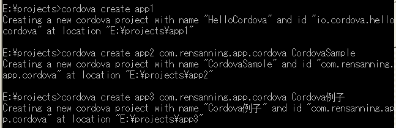
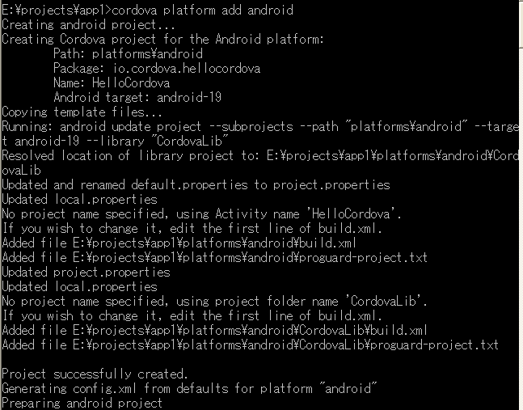
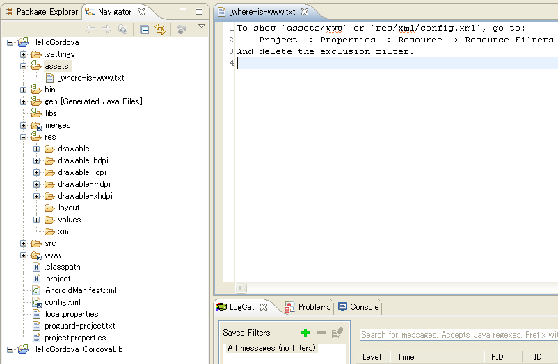
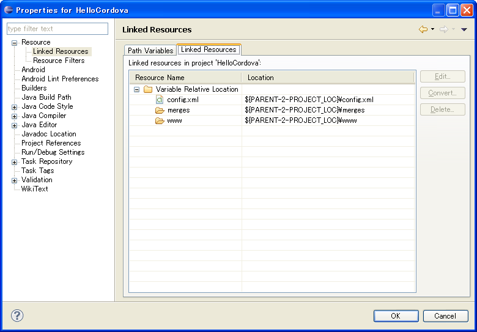
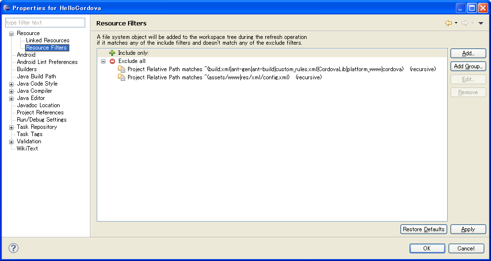

# Cordova 3.x 基础（6） -- Sample 工程解析

## （1）通过 Cordova CLI 创建 Cordova 工程 

最简化创建应用： 

**引用**

```
cordova create app1
```

***默认使用 package 名：io.cordova.hellocordova、应用名：HelloCordova。 

指定 package 名和应用名： 

**引用**

```
cordova create app2 com.rensanning.app.cordova CordovaSample
```

***也可以单独只指定 package 名 

带汉字的应用名： 

**引用**

```
cordova create app3 com.rensanning.app.cordova Cordova例子
```

***config.xml 文件使用'UTF-8'编码。




## （2）www 文件夹下的代码 

成功创建完成工程后，Cordova 会默认生成 index.html, css/index.css, img/logo.png 和 js/index.js。 

index.hml   
针对 Webview 应用的设置 

Html **代码**

```
<meta name="format-detection" content="telephone=no" />
<meta name="viewport" content="user-scalable=no, initial-scale=1, maximum-scale=1, minimum-scale=1, width=device-width, height=device-height, target-densitydpi=device-dpi" />
```

调用 Cordova 核心 API 的 js 

Html **代码**

```
<script type="text/javascript" src="cordova.js"></script>
```

***从 Cordova 3开始采用 plugin 的方式提供核心 API，所以 cordova.js 文件中只是提供一些基本函数。 

调用 index.js 

Html **代码**

```
<script type="text/javascript" src="js/index.js"></script>
<script type="text/javascript">
    app.initialize();
</script>
```

initialize()函数实际上是做 deviceready 事件的监听设置，当 deviceready 完成后，显示“Device is Ready”把“Connecting to Device”隐藏。 

## （3）Android 工程 

添加平台支持   
cordova platform add android   
***Cordova 会调用 Android SDK 在 app1\platforms\android 中创建一个完整的 Android 应用工程。 



工程目录结构   
assets\www   
这个就是 Cordova 工程根目录下的 www 文件夹的所有内容。（cordova.js 和 cordova_plugins.js 是 Cordova 自动创建的） 

***可见 Cordova 最终也会把你的代码以 assets 的形式打包到 apk 中，所以代码安全上，需要对 js 等进行压缩，核心代码最好不要放在客户端！！！ 

CordovaLib   
从3.3以后，Cordova 从.jar 改成了 Library Project 的形式。 

cordova   
编译、运行工程的脚本。 

platform_www   
[防止用户换机器.cordova/lib 不存在](https://issues.apache.org/jira/browse/CB-5063)，备份 cordova.js 到此文件夹。build 的时候实际上是用的这个文件。 

libs   
空的文件夹，以前版本可能包含 cordova-*.jar。如果你想添加 android-support-v4.jar，可以通过[插件的形式](https://github.com/MobileChromeApps/cordova-plugin-android-support-v4)添加。

## （4）在 Eclipse 中 Import Android 工程 

在 Cordova 创建 Eclipse 的 Android 工程，做了两个特殊的设置：   

- 让 Android 工程下的"assets/www"和"res/xml/config.xml"不可见（还有一些其他不希望用户修改的文件夹）
- 把 Cordova 工程的 merges 文件夹、www 文件夹、config.xml 文件链接到了 Android 工程下



因为 platforms\android 下的代码都是在 build 的时候自动生成的，所以修改的话没有什么意义，应该修改 Cordova 工程根目录下的文件。你也可以通过 Eclipse 的 Resource 设置把他们显示出来。





Cordova Android 工程的代码不是特别的复杂，通过继承 CordovaActivity 在首页面的 Activity 中，解析 config.xml 文件，做初期化设置，然后嵌入 CordovaWebView 并加载 config.xml 中配置的页面 URL。 

Cordova 只是一个 Webview 的架子，只提供给你能够调用 Native API 的接口，在 UI 方面他不会管你页面是什么样子，也不会提供给你任何 UI 方面的功能，所以 UI 方面还要借助于 [jQuery Mobile](http://jquerymobile.com/)、[Sencha Touch](http://www.sencha.com/products/touch)、[App Framework（jQMoby）](http://app-framework-software.intel.com/)、[KendoUI Mobile](http://www.telerik.com/kendo-ui-mobile)、[Adobe Topcoat](http://topcoat.io/)、[jQTouch](http://jqtjs.com/)、[Ionic Framework](http://ionicframework.com/)、[Onsen UI](http://onsenui.io/) 等等。