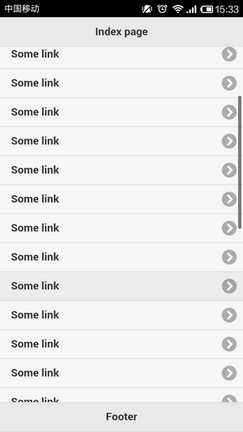

# Cordova 3.x 基础（8） -- 几个不可或缺的 lib

**（1）Zepto.js [http://zeptojs.com/](http://zeptojs.com/)** 

jQuery 绝对是最流行的类库，但是现在对它的批评是越来越多，主要问题是它的大小，即使版本2.0中去除了对于 IE6，IE7和 IE8的支持，但是仍旧体积比较大，特别对于移动设备来说。 相比人们开始更加关注 Vanilla JS http://vanilla-js.com/，它对于 DOM 处理以外的内容更快，更高效。 对于 Hybrid App 来说，Zepto.js 可能更加合适，因为它是针对移动 WebKit 开发，显得更轻量级。 

**（2）FastClick [https://github.com/ftlabs/fastclick](https://github.com/ftlabs/fastclick)** 

基于 Webkit 的浏览都存在 click 事件300 ms 延迟，而 FastClick 能够移除这个延迟加速 Touch事件。还有 Tappable，也是不错的选择。 

Js **代码**

```
document.addEventListener('deviceready', onDeviceReady, false);
function onDeviceReady() {
  FastClick.attach(document.body); 
}
```

**（3）iScroll  [https://github.com/cubiq/iscroll](https://github.com/cubiq/iscroll)** 

固定高度的容器内滚动内容，针对 jQuery Mobile 还有一个 iScroll wrapper 叫 [iScrollview](https://github.com/watusi/jquery-mobile-iscrollview) 

Html **代码**

```
<!DOCTYPE html>
<html>
<head>
  <meta charset="utf-8" />
  <meta name="format-detection" content="telephone=no" />
  <meta name="viewport" content="user-scalable=no, initial-scale=1, maximum-scale=1, minimum-scale=1, width=device-width, height=device-height" />
  <link rel="stylesheet" type="text/css" href="lib/jquery.mobile/jquery.mobile-1.4.1.min.css" />
  <link rel="stylesheet" type="text/css" href="lib/jquery.mobile.iscrollview/jquery.mobile.iscrollview.css" />
  <link rel="stylesheet" type="text/css" href="lib/jquery.mobile.iscrollview/jquery.mobile.iscrollview-pull.css" />
  <title>Cordova Sample</title>
  <style>
  .ui-content {
      padding: 0 !important;
  }
  .ui-listview {
      margin: 0 !important;
  }
  .example-wrapper, .example-wrapper div.iscroll-scroller {
      width: 100% !important;
  }
  </style>
</head>
<body>

<div data-role="page" id="index">
    <div data-role="header">
        <h1>Index page</h1>
    </div>
    <div data-role="content">
        <div class="example-wrapper" data-iscroll>
            <ul data-role="listview">
                <li><a href="#">Some link</a></li>
                <li><a href="#">Some link</a></li>
                <li><a href="#">Some link</a></li>
                <li><a href="#">Some link</a></li>
                <li><a href="#">Some link</a></li>
                <li><a href="#">Some link</a></li>
                <li><a href="#">Some link</a></li>
                <li><a href="#">Some link</a></li>
                <li><a href="#">Some link</a></li>
                <li><a href="#">Some link</a></li>
                <li><a href="#">Some link</a></li>
                <li><a href="#">Some link</a></li>
                <li><a href="#">Some link</a></li>
                <li><a href="#">Some link</a></li>
                <li><a href="#">Some link</a></li>
                <li><a href="#">Some link</a></li>
                <li><a href="#">Some link</a></li>
                <li><a href="#">Some link</a></li>
                <li><a href="#">Some link</a></li>
                <li><a href="#">Some link</a></li>
                <li><a href="#">Some link</a></li>
                <li><a href="#">Some link</a></li>
                <li><a href="#">Some link</a></li>
                <li><a href="#">Some link</a></li>
                <li><a href="#">Some link</a></li>
                <li><a href="#">Some link</a></li>
                <li><a href="#">Some link</a></li>
                <li><a href="#">Some link</a></li>
                <li><a href="#">Some link</a></li>
                <li><a href="#">Some link</a></li>
                <li><a href="#">Some link</a></li>
                <li><a href="#">Some link</a></li>
            </ul>
        </div>
    </div>
    <div data-role="footer">
        <h1>Footer</h1>
    </div>
</div>
<script type="text/javascript" src="cordova.js"></script>
<script type="text/javascript" src="lib/jquery/jquery-1.11.0.min.js"></script>
<script type="text/javascript" src="lib/jquery.mobile/jquery.mobile-1.4.1.min.js"></script>
<script type="text/javascript" src="lib/iscroll/iscroll.js"></script>
<script type="text/javascript" src="lib/jquery.mobile.iscrollview/jquery.mobile.iscrollview.js"></script>
</body>
</html>
```



**（4）Hammer.js [http://eightmedia.github.io/hammer.js/](http://eightmedia.github.io/hammer.js/)** 

多点触控   

Js **代码**

```
var hammer = new Hammer(document.getElementById("container"));

hammer.ondragstart = function(ev) { };
hammer.ondrag = function(ev) { };
hammer.ondragend = function(ev) { };

hammer.ontap = function(ev) { };
hammer.ondoubletap = function(ev) { };
hammer.onhold = function(ev) { };

hammer.ontransformstart = function(ev) { };
hammer.ontransform = function(ev) { };
hammer.ontransformend = function(ev) { };
```

**（5）Handlebars [http://handlebarsjs.com/](http://handlebarsjs.com/)** 

[Ember.js](http://emberjs.com/) 使用的是 Handlebars 模板引擎。 

Html **代码**

```
<div id="menu-placeholder"></div>
<script id="menu-template" type="text/x-handlebars-template">
    <ul>
        {{#each menu}}
            <li><a href="{{link}}">{{name}}</a></li>
        {{/each}}
    </ul>
</script>
<script type="text/javascript">
(function() {

  // Grab the HTML source that needs to be compiled
  var menuSource = document.getElementById( 'menu-template' ).innerHTML;

  // Compiles the source
  var menuTemplate = Handlebars.compile( menuSource );

  //Data that will replace the handlebars expressions in our template
  var menuData = {
      menu: [
          { name: "Link 1", link: "http://google.com" },
          { name: "Link 2", link: "http://yahoo.com" },
          { name: "Link 3", link: "http://youtube.com" },
          { name: "Link 4", link: "http://twitter.com" },
      ]
  };

  // Process Template with Data
  document.getElementById( 'menu-placeholder' ).innerHTML = menuTemplate( menuData );
})();
</script>
```

说到 Ember.js 就应该提提 **AngularJS** [http://angularjs.org/](http://angularjs.org/) 它是 Google 开发的 JavaScript MVW Framework，这里有一些参考资料：[http://www.iteye.com/news/28651-AngularJS-Google-resource](http://www.iteye.com/news/28651-AngularJS-Google-resource) MVC 框架层数不穷，[TodoMVC](http://todomvc.com/) 使用各种 JavaScript MV*框架实现同一个应用 Todo，可以帮助你挑选合适的MV*框架。 

**（6）Q.js [https://github.com/kriskowal/q](https://github.com/kriskowal/q)** 

Q.js 是 [Promises/A+规范](https://github.com/kriskowal/q)的一个实现，将嵌套异步序列（Pyramid of Doom）转化为类似同步的序列。 
比如，嵌套异步序列： 

Js **代码**

```
step1(function (value1) {
    step2(value1, function(value2) {
        step3(value2, function(value3) {
            step4(value3, function(value4) {
                // Do something with value4
            });
        });
    });
});
```

改造后： 

Js **代码**

```
Q.fcall(promisedStep1)
.then(promisedStep2)
.then(promisedStep3)
.then(promisedStep4)
.then(function (value4) {
    // Do something with value4
})
.catch(function (error) {
    // Handle any error from all above steps
})
.done();
```

当然也还有很多其他的实现，比如：   

- Async.js https://github.com/caolan/async
- RSVP.js https://github.com/tildeio/rsvp.js
- when.js https://github.com/cujojs/when
- AngularJS的$q https://docs.angularjs.org/api/ng/service/$q


参考：   
[PhoneGap 应用开发的那些坑爹事儿](http://ftqq.com/category/webformobile/)   
[Phonegap 踩过的坑](http://snoopyxdy.blog.163.com/blog/static/60117440201432491123551/)   
[Android Hybrid App 四大坑](http://blog.meathill.com/tech/app/web/traps-in-developing-android-hybrid-app.html)   
[别闯进 Hybrid App 的误区](http://www.infoq.com/cn/articles/hybridapp-misunderstanding)   
[Hybrid App 开发实战](http://www.infoq.com/cn/articles/hybrid-app-development-combat)   
[Mobile Web App Checklist](http://www.luster.io/blog/9-29-14-mobile-web-checklist.html)   
