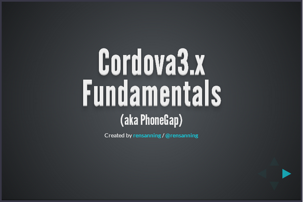
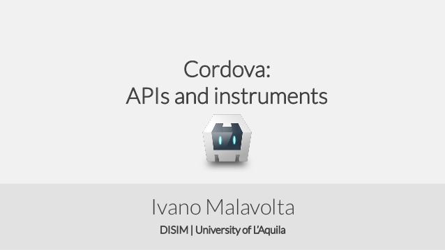
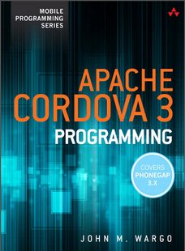
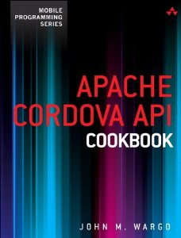
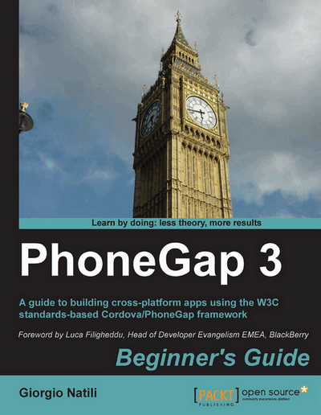
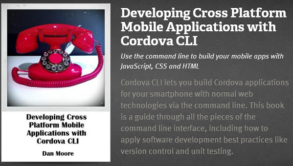

# Cordova 3.x 基础（16） -- slides & books

[Cordova(aka PhoneGap) 3.x Fundamentals](http://slidedeck.io/rensanning/cordova-3-fundamentals) 

[Cordova APIs and instruments](http://www.slideshare.net/iivanoo/cordova-apis-and-instruments) 

[Apache Cordova 3 Programming](http://dl.iteye.com/topics/download/37f91de7-322b-3d62-b311-64779c09758e) 

[Source code from Apache Cordova 3 Programming](https://github.com/johnwargo/cordova-programming-code) 

[Apache Cordova API Cookbook](http://www.amazon.com/dp/0321994809)

[Source code for Apache Cordova API Cookbook](https://github.com/johnwargo/apache-cordova-api-cookbook-code) 

[PhoneGap 3, Beginner's Guide, 2nd Edition](http://dl.iteye.com/topics/download/d54aba6a-6aa8-331a-a08d-7d8e8a6110a5)  

[Developing Cross Platform Mobile Applications with Cordova CLI](https://leanpub.com/developingwithcordovacli) 

印度 vskills 提供“[Certified Cordova Mobile Application Developer](http://www.vskills.in/certification/Cordova-Mobile-Application-Developer-Certification)”，不是免费的需要2670卢比（大概不到300 RMB）。

 