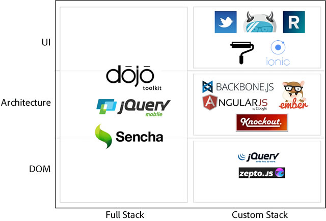
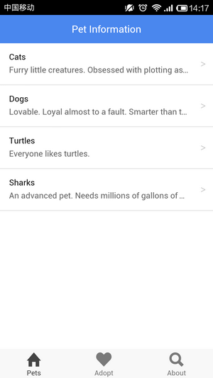

# Cordova 3.x 基础（10） -- UI 框架 Ionic Framework

Ionic 是 [Drifty](http://drifty.com/) 继 [Codiqa](https://codiqa.com/)（基于 Web 的 jQuery Mobile 构建工具）和 [Jetstrap](https://jetstrap.com/)（基于 Web 的 Twitter Bootstrap 构建工具）之后的第三个项目。面向使用 HTML5开发混合式应用的的前端UI开源框架。 

[http://ionicframework.com/](http://ionicframework.com/) 

Demos [http://codepen.io/ionic/public-list](http://codepen.io/ionic/public-list)   
Showcase [http://showcase.ionicframework.com/](http://showcase.ionicframework.com/)   
Forum [http://forum.ionicframework.com/](http://forum.ionicframework.com/)   
Documentation [http://ionicframework.com/docs/](http://ionicframework.com/docs/)   
Learn Ionic [http://learn.ionicframework.com/](http://learn.ionicframework.com/)   
Ionic Crash Course [https://www.youtube.com/watch?v=C-UwOWB9Io4](https://www.youtube.com/watch?v=C-UwOWB9Io4)   
Ionic Tutorial [http://ccoenraets.github.io/ionic-tutorial/](http://ccoenraets.github.io/ionic-tutorial/)   
Structure of an Ionic App [http://mcgivery.com/structure-of-an-ionic-app/](http://mcgivery.com/structure-of-an-ionic-app/) 


Book:   
[Manning: Ionic in Action](http://www.manning.com/wilken/) 

[ngCordova](http://ngcordova.com/)：Cordova API 的 AngularJS 扩展   
[Ionicons](http://ionicons.com/)：免费的 icon font   
[Ionic Creator](http://ionicframework.com/creator/)：在线可视化工具 

[https://github.com/ecofic/ngCordovaMocks](https://github.com/ecofic/ngCordovaMocks)：ngCordovaMocks   
[https://github.com/driftyco/ionic-cordova-android-vagrant](https://github.com/driftyco/ionic-cordova-android-vagrant)：Ionic Cordova Android Vagrant 

官方 Blog 上推荐的 Built with Ionic 应用： 

- Songhop [https://songhop.fm/](https://songhop.fm/)
- Mallzee [http://mallzee.com/](http://mallzee.com/)
- Sworkit [http://sworkit.com/](http://sworkit.com/)
- Coride [https://coride.co/](https://coride.co/)
- Throwback [http://www.throwbacknow.com/](http://www.throwbacknow.com/)
- HabitRPG [https://habitrpg.com/static/front](https://habitrpg.com/static/front)
- Crafted Here [http://www.craft-boom.com/](http://www.craft-boom.com/)
- FitRPG [http://fitrpg.co/](http://fitrpg.co/)

目前版本发布的速度很快，具体可以参考 [https://github.com/driftyco/ionic/blob/master/CHANGELOG.md](https://github.com/driftyco/ionic/blob/master/CHANGELOG.md) 

需要注意的是： 

- 目前还是 Beta 版
- 面向 Hybrid Mobile App 而不是 Mobile Web App
- 只支持 iOS 6+ / Android 4+

和 jQuery Mobile 不同的是 Ionic 只关注的是UI部分，类似的还有 Twitter Bootstrap, Foundation, Ratchet, Topcoat 等。可以看看官方对框架的解释：[Where does the Ionic Framework fit in?](http://ionicframework.com/blog/where-does-the-ionic-framework-fit-in/)。熟悉 Bootstrap 的还可以试试基 于Angularjs 和 Bootstrap 3的 [Mobile Angular UI with Bootstrap 3](https://github.com/mcasimir/mobile-angular-ui)。



来源：[http://coenraets.org](http://coenraets.org) 

- 采用 Sass/Gulp、基于 AngularJS、零 jQuery、最小化 DOM 操作  
- 非常棒的性能、漂亮的界面设计、详细的文档、活跃的社区

Ionic 提供了很多 Directive 指令（使用 JavaScript 来实现语义化标签，类似于 jsp 的 taglib）实现丰富的 UI 控件、大量的常用 icon （[Icon Pack](http://ionicons.com/)）、使用 AngularUI Router 模块来记录页面路由、采用 Hammer.js 做多点触控、通过 AngularJS 的扩展做 UI 交互、左右滑动菜单、下拉更新、自定义主题（核心 CSS 基于 Sass）.......。官方网站也提供了很详细的使用说明。 

安装 ionic 

**引用**

```
$ npm install -g cordova gulp ionic
```

新建项目 

**引用**

```
$ ionic start myApp blank  新建一个空白页面 
$ ionic start myApp tabs  新建一个带底部标签的页面 
$ ionic start myApp sidemenu 新建一个带侧边栏的页面
```

运行项目 

**引用**

```
$ cd MyApp 
$ ionic platform add ios 
$ ionic build ios 
$ ionic emulate ios
```

另外项目用到 gulp 来做自动化项目构建。 

其中 start 一个项目的时候是从 github 上下载 [seed 工程](https://github.com/driftyco/ionic-angular-cordova-seed)后展开使用，所以也可以通过 Cordova CLI 创建一个工程后删除 www 文件夹，从 github 上下载 [seed 工程](https://github.com/driftyco/ionic-angular-cordova-seed)后解压覆盖 www 文件夹即可。 



也可以从 [http://code.ionicframework.com/](也可以从http://code.ionicframework.com/手动下载。 )手动下载。 


--> 2014/05/19   
安装或更新时候的错误： 

①提示以下错误是因为没有安装 Python： 

**引用**

```
gyp ERR! configure error 
gyp ERR! stack Error: Can't find Python executable "python", you can set the PYTHON env variable. 
gyp ERR! stack     at failNoPython (C:\Program Files\nodejs\node_modules\npm\node_modules\node-gyp\lib\configure.js:113:14) 
gyp ERR! stack     at C:\Program Files\nodejs\node_modules\npm\node_modules\node-gyp\lib\configure.js:81:11 
gyp ERR! stack     at Object.oncomplete (fs.js:107:15)
```

②如果安装的是 python3比如 python-3.4.0，会提示以下错误，安装 python-2.7.6就 OK 啦。 

**引用**

```
gyp ERR! configure error 
gyp ERR! stack Error: Python executable "python" is v3.4.0, which is not supported by gyp. 
gyp ERR! stack You can pass the --python switch to point to Python >= v2.5.0 & < 3.0.0. 
gyp ERR! stack     at failPythonVersion (C:\Program Files\nodejs\node_modules\npm\node_modules\node-gyp\lib\configure.js:118:14) 
gyp ERR! stack     at C:\Program Files\nodejs\node_modules\npm\node_modules\node-gyp\lib\configure.js:107:9 
gyp ERR! stack     at ChildProcess.exithandler (child_process.js:635:7) 
gyp ERR! stack     at ChildProcess.EventEmitter.emit (events.js:98:17) 
gyp ERR! stack     at maybeClose (child_process.js:735:16) 
gyp ERR! stack     at Process.ChildProcess._handle.onexit (child_process.js:802:5)
```

【原因】   
查看了一下 CLI 的源代码，ionic 引入了 vinyl-fs 的依赖，用于 npm\node_modules\ionic\lib\ionic\serve.js 中，vinyl-fs 的 vfs.watch('www/**/*')，而它又有子依赖：vinyl-fs@0.1.4 -> glob-watcher@0.0.6 -> gaze@0.6.4。gaze 的源码是 C++的，需要做本地编译，[node-gyp](https://github.com/TooTallNate/node-gyp) 是 Node.js 本地代码编译构建工具，查看它的安装说明，需要 Python2不支持 Python3，还需要 Visual Studio C++的支持。再查看 [ionic-cli 的修改历史记录](https://github.com/driftyco/ionic-cli/commit/ee87fb0fce90f8ff8b31424aa82674e575bf0103)，发现是为了支持 Livereload 才引入了 vinyl-fs。 

本地测试： 

**（1）启动Python**   
进入工程的 www 文件夹，执行“python -m SimpleHTTPServer 8000”后，在 Chrome 或 Safari 中输入“http://localhost:8000”就可以测试了。 

**（2）启动 Gulp**   
项目用到 gulp 来做自动化项目构建 

修改 gulpfile.js 

Js **代码** 

```
var gulp = require('gulp'),
  connect = require('gulp-connect');

gulp.task('connect', function() {
  connect.server({
    root: 'www',
    livereload: true
  });
});

gulp.task('html', function () {
  gulp.src('./www/*.html').pipe(connect.reload());
});

gulp.task('watch', function () {
  gulp.watch(['./www/*.html'], ['html']);
});

gulp.task('default', ['connect', 'watch']);
```

**引用**

```
$ cd myApp 
$ npm install -g gulp 
$ npm install 
$ gulp
```

访问： http://localhost:8080 

**（3）其他HTTP server **  
还有很多其他的 Simple HTTP server，比如：http-server 就是一个 NodeJS 下很好用的 HTTP Server 

**引用**

```
npm install http-server -g
```

基本使用： 

Html **代码**

```
<!DOCTYPE html>
<html>
  <head>
    <meta charset="utf-8">
    <meta name="viewport" content="width=device-width, initial-scale=1, maximum-scale=1, user-scalable=no">
    <!-- Ionic的CSS -->
    <link href="lib/ionic/css/ionic.css" rel="stylesheet">
    <!-- 包含了Ionic核心JS、AngularJS、Ionic的AngularJS扩展、ngAnimate/ngSanitize/ui.router模块 -->
    <script src="lib/ionic/js/ionic.bundle.js"></script>
    <SCRIPT LANGUAGE="JavaScript">
    <!--
      // 创建一个AngularJS模块并告诉Angular初期化它
      angular.module('starter', ['ionic']);
    //-->
    </SCRIPT>
  </head>
  <body ng-app="starter">
    <ion-header-bar class="bar-positive">
      <h1 class="title">header</h1>
    </ion-header-bar>
    <ion-content padding="true">
      <h1>Hello wrold!</h1>
    </ion-content>
    <ion-footer-bar align-title="left" class="bar-assertive">
      <h1 class="title">footer</h1>
    </ion-footer-bar>
  </body>
</html>
```


- 整体是 [SPA（Single Page Application)](http://singlepageappbook.com/)
- 除过 index.html 外的所有页面（放入 templates 文件夹下）通过 Ajax 加载
- 基于 Angular UI 做页面路由
- Controller 中做事件绑定和数据绑定
- View 复杂的处理使用 Directive・Filter
- Model 中的共通处理委托给 Service、Factory

单纯使用 CSS（ionic 很多功能是通过 JS 实现的所以只使用单纯 CSS 意义不大）： 

Html **代码**

```
<!DOCTYPE html>
<html>
  <head>
    <meta charset="utf-8">
    <meta name="viewport" content="initial-scale=1, maximum-scale=1, user-scalable=no, width=device-width">
    <link href="lib/ionic/css/ionic.css" rel="stylesheet">
  </head>
  <body>
    <div class="bar bar-header bar-positive">
      <h1 class="title">header</h1>
    </div>
    <div class="scroll-content has-header has-footer">
      <div class="card">
        <div class="item item-divider">
          I'm a Header in a Card!
        </div>
        <div class="item item-text-wrap">
          This is a basic Card with some text.
        </div>
        <div class="item item-divider">
          I'm a Footer in a Card!
        </div>
      </div>
      <div class="card">
        <div class="item item-divider">
          I'm a Header in a Card!
        </div>
        <div class="item item-text-wrap">
          This is a basic Card with some text.
        </div>
        <div class="item item-divider">
          I'm a Footer in a Card!
        </div>
      </div>
    </div>
    <div class="bar bar-footer bar-positive">
      <h1 class="title">footer</h1>
    </div>
  </body>
</html>
```

几个完整的 Project 模板 ionFullApp、ionWordpress。   
[http://codecanyon.net/collections/4884964-ionic-apps](http://codecanyon.net/collections/4884964-ionic-apps) 

[AngularJS Chrome 调试插件 Batarang](https://chrome.google.com/webstore/detail/angularjs-batarang/ighdmehidhipcmcojjgiloacoafjmpfk)   
Building Beautiful Mobile Apps In Visualforce Using AngularJS And Ionic [Part 1](https://developer.salesforce.com/blogs/developer-relations/2014/04/building-beautiful-mobile-apps-in-visualforce-using-angularjs-and-ionic-part-1.html)、 [Part 2](https://developer.salesforce.com/blogs/developer-relations/2014/04/part-2-building-beautiful-mobile-apps-in-visualforce-using-angularjs-and-ionic.html)、 [Part 3](https://developer.salesforce.com/blogs/developer-relations/2014/04/building-beautiful-mobile-apps-in-visualforce-using-angularjs-and-ionic-part-3-remote-objects.html)   
[http://www.zhouwenbin.com/tag/ionic/](http://www.zhouwenbin.com/tag/ionic/)   
[http://julienrenaux.fr/2014/05/09/ionic-framework-features-you-may-have-missed/](http://julienrenaux.fr/2014/05/09/ionic-framework-features-you-may-have-missed/)

