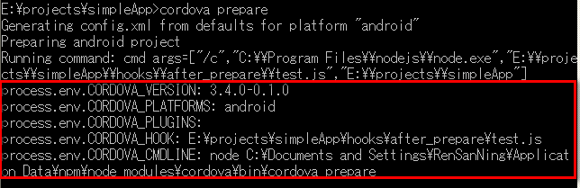
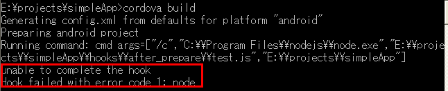

# Cordova 3.x 基础（14） -- 使用 Hooks 自定义 build 过程

Hooks 本身是一些脚本代码，可以使用任何语言（比如：nodejs、shell 等），用来自定义 Cordova CLI 命令，位于 Cordova 项目的根目录 hooks 文件夹下。主要目的是扩展 Cordova CLI 框架，在应用的 build 生命周期中插入自定义的 build 构建内容。 

**（1）Hooks的种类**  

①Module-level Hooks 

面向的是扩展 Cordova 平台的，这个是相对比较大的项目的，所以一般都很少用到，有兴趣可以去 Google 一下“Cordova EventEmitter method”。   
[https://www.npmjs.org/package/cordova](https://www.npmjs.org/package/cordova) 

②Project-specific Hooks 

所有的脚本文件必须放在 Cordova CLI 命令对应的 before 或 after 文件夹中。   
hooks/before_xxx   
hooks/after_xxx   
其中 xxx 就是 Cordova CLI 对应的命令，比如：prepare、build 等。 

**（2）脚本执行顺序**

before_xxx 或 after_xxx 文件夹中的脚本文件是按字母的顺序排序后依次执行的。这里的字母顺序还跟使用的平台有关，比如：Windows 下 ae.js 在 aG.js 之前， 而 Linux 下 aG.js 在 ae.js 之前。所以最好是在你的脚本文件名前添加3到4位的数字来标示它的顺序。 
比如： 

**引用**

```
001_copy_files.js 
010_copy_resources.js 
020_modify_config_files.sh 
120_delete_modified_files.js
```

**（3）Hook 脚本文件 **

脚本文件被执行时，默认会把根目录路径作为第一个参数传递给脚本文件。 

Node.js 

**引用**

```
#!/usr/bin/env node 
var fs = require('fs'); 

var rootdir = process.argv[2]; 

// ... using rootdir
```

Shell Script 

**引用**

```
#!/bin/sh 

ROOTDIR=$1 

# ... using $ROOTDIR
```

脚本文件中可以通过环境变量来获取其他参数： 

- CORDOVA_VERSION：Cordova CLI 的版本
- CORDOVA_PLATFORMS：逗号隔开的 platforms 一览
- CORDOVA_PLUGINS：逗号隔开的 plugin IDs 一览
- CORDOVA_HOOK：执行中 hook 的路径
- CORDOVA_CMDLINE：Cordova CLI 命令后的参数


**引用**

```
#!/usr/bin/env node 

console.log("process.env.CORDOVA_VERSION: "+process.env.CORDOVA_VERSION); 
console.log("process.env.CORDOVA_PLATFORMS: "+process.env.CORDOVA_PLATFORMS); 
console.log("process.env.CORDOVA_PLUGINS: "+process.env.CORDOVA_PLUGINS); 
console.log("process.env.CORDOVA_HOOK: "+process.env.CORDOVA_HOOK); 
console.log("process.env.CORDOVA_CMDLINE: "+process.env.CORDOVA_CMDLINE);
```



在脚本文件中你可以使用脚本语言的所有功能。但是在 build 之前首先要确保你的脚本文件能够正常执行。 

**（4）停止 build** 

在 hook 脚本中，我们有时候需要停止整个 build，比如：在 before_prepare 做单元测试的时候，如果测试失败，就应该停止 build。hook 脚本中如果返回值不是0，就会停止 build。 

**引用**

```
#!/usr/bin/env node 
     
console.log("unable to complete the hook"); 
process.exit(1);
```



**（5）常用 Hook** 

- 添加工程所需的 plugins（after_platform_add）
- 拷贝 icons、splash screens 等 resource 到各个平台(after_prepare)
- 运行单元测试（before_build）
- 替换一些配置信息，比如：api 服务器地址(after_prepare)

Cordova 在 build 的时候是把 www 文件夹原封不动的 Copy 到了 platform 的 www 文件夹中，如果有人反编译你的 app 文件就能够获得你的所有源码。所以有必要创建一个 hook 来对你的代码进行安全处理。 

根据 JSON  串的定义在 Build 之前生成 menu.xml 来支持 Android 的原生菜单   
[https://github.com/ktty1220/cordova-native-menu/blob/master/hooks/before_build/native-menu.js](https://github.com/ktty1220/cordova-native-menu/blob/master/hooks/before_build/native-menu.js) 


参考： 

[https://github.com/apache/cordova-cli/blob/master/templates/hooks-README.md](https://github.com/apache/cordova-cli/blob/master/templates/hooks-README.md)   
[https://leanpub.com/developingwithcordovacli/read](https://leanpub.com/developingwithcordovacli/read)   
[https://gist.github.com/dpogue/4100866](https://gist.github.com/dpogue/4100866)   
[http://devgirl.org/2013/11/12/three-hooks-your-cordovaphonegap-project-needs/](http://devgirl.org/2013/11/12/three-hooks-your-cordovaphonegap-project-needs/)   
[http://www.mooreds.com/wordpress/cordova-cli](http://www.mooreds.com/wordpress/cordova-cli)  